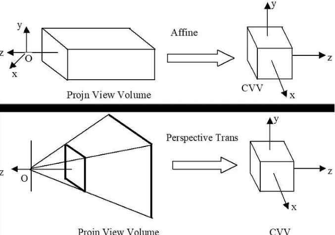
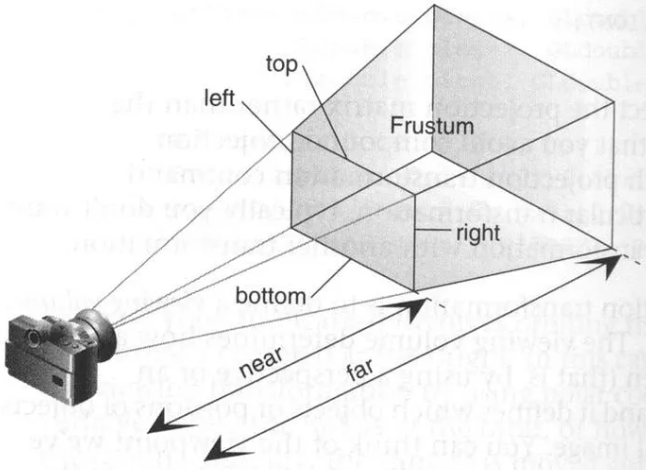

- [Basics of 3D Transformation](#basics-of-3d-transformation)
  - [3D Transformations](#3d-transformations)
    - [3D Rotations](#3d-rotations)
  - [3D to 2D Projection](#3d-to-2d-projection)
    - [Orthographic Projection](#orthographic-projection)
    - [Perspective Projection](#perspective-projection)
    - [Camera coordinate system (3D)](#camera-coordinate-system-3d)
    - [Pinhole Model](#pinhole-model)
    - [Conclusion](#conclusion)
- [References](#references)


# Basics of 3D Transformation

3D transformation are similar to 2D transformation but we now have to deal with extra corordinate or extra dimesnion Z axis or z coordinate. 3D graphics techniques and their application are fundamental to the entertainment, games, and computer-aided design industries.

## 3D Transformations

The set of three-dimensional coordinate transformations is very similar to that available for 2D transformations As in 2D, these transformations form anested set of groups. Here is the more detailed description of this hierarchy.

||
|:--:|
|*Hierarchy of 3D coordinate transformations*|

1. **Translation**
    2D translation can be written as $`\mathbf{x}^{\prime}=\mathbf{x}+\mathbf{t}`$,
    In matrix form as:

    ```math
    \mathbf{x}^{\prime}=\left[\mathbf{I}\quad\mathbf{t}\right]\overline{\mathbf{x}} ,
    ```

    where $`I`$is the 3 × 3 identity matrix.
    <br>

2. **Rotation + translation**
    Also known as 3D rigid body motion or the 3D Euclidean transformation or SE(3), it can be written as $`\mathbf{x}^{\prime}=\mathbf{R}\mathbf{x}+\mathbf{t}`$
    In matrix form as:

    ```math
    \mathbf{x}^{\prime}=\left[\mathbf{R}\quad\mathbf{t}\right]\overline{\mathbf{x}}, 
    ``` 

    where $`R`$ is a 3 × 3 is an orthonormal rotation matrix with $`\mathbf{RR}^{T}=\mathbf{I} \ and \ |\mathbf{R}|=1.`$ . It is more convenient to describe a rigid motion using

    ```math 
    \mathbf{x}^{\prime}=\mathbf{R}(\mathbf{x}-\mathbf{c})=\mathbf{R}\mathbf{x}-\mathbf{R}\mathbf{c}
    ```

    where c is the center of rotation (often the camera center). Compactly parameterizing a 3D rotation is a non-trivial task.
    <br>

3. **Scaled rotation**
    The 3D similarity transform can be expressed as $`\mathbf{x}^{\prime}=\mathbf{sR}\mathbf{x}+\mathbf{t}`$ where $`s`$`
    is an arbitrary scale factor. It can also be written as

    ```math
    \mathbf{x}^{\prime}=\left[\mathbf{sR}\quad\mathbf{t}\right]\overline{\mathbf{x}}, 
    ```

    This transformation preserves angles between lines and planes.
    <br>

4. **Affine**
    The affine transform is written as $`\mathbf{x}^{\prime}=\mathbf{A}\mathbf{x}+\mathbf{t}`$, where $`A`$` is an arbitrary 3 × 4 matrix,

    ```math
    \mathbf{x}^{\prime}=\left[\mathbf{A}\quad\mathbf{t}\right]\overline{\mathbf{x}}, 
    ```

    where A is an arbitrary 3 × 4 matrix, i.e.

    ```math
    A = \left[{\begin{array}{cc}a_{00} & a_{01} & a_{02} & a_{03} \\ a_{10} & a_{11} & a_{12} & a_{13} \\ a_{20} & a_{21} & a_{22} & a_{23} \end{array}}\right]
    ```

    Parallel lines and planes remain parallel under affine transformations.
    <br>

5. **Projective**
    This transformation, variously known as a 3D perspective transform, homography, or collineation, operates on homogeneous coordinates,

    ```math
    \tilde{x}^{\prime}=\tilde{\mathrm{H}}\tilde{x}
    ```

    where $`\tilde{\mathrm{H}}`$ is an arbitrary 4 × 4 homogeneous matrix. As in 2D, the resulting homogeneous coordinate $`x^{\prime}`$ must be normalized in order to obtain an inhomogeneous result $`x`$. Perspective transformations preserve straight lines (i.e., they remain straight after the transformation).
    <br>

### 3D Rotations

The biggest difference between 2D and 3D coordinate transformations is that the parameterization of the 3D rotation matrix R is not as straightforward, as several different possibilities exist.

1. **Rotation matrices**
    We start off with the standard definition of the rotations about the three principle axes.
    A rotation of $`\psi`$ radians about the $`x`$-axis is defined as:

    ```math
    R_{x}(\psi)={\left[\begin{array}{l l l}{1}&{0}&{0}\\ {0}&{\cos\psi}&{-\sin\psi}\\ {0}&{\sin\psi}&{\cos\psi}\end{array}\right]}
    ```

    A rotation of $`\theta`$ radians about the $`y`$-axis is defined as:

    ```math
    R_{\mathrm{y}}(\theta)=\left[\begin{array}{c c c}{{\cos\theta}}&{{0}}&{{\sin\theta}}\\ {{0}}&{{1}}&{{0}}\\ {{-\sin\theta}}&{{0}}&{{\cos\theta}}\end{array}\right]
    ```

    A rotation of $`\phi`$ radians about the $`z`$-axis is defined as:

    ```math
    R_{z}(\phi)=\left[\begin{array}{c c c}{{\cos\phi}}&{{-\sin\phi}}&{{0}}\\ {{\sin\phi}}&{{\cos\phi}}&{{0}}\\ {{0}}&{{0}}&{{1}}\end{array}\right]
    ```

    The angles $`ψ, θ, \ and \ φ`$ are the Euler angles.
    <br>

    **A general rotation matrix can will have the form:**

    ```math
    R={\left[\begin{array}{l l l}{R_{11}}&{R_{12}}&{R_{13}}\\ {R_{21}}&{R_{22}}&{R_{23}}\\ {R_{31}}&{R_{32}}&{R_{33}}\end{array}\right]} 
    ```

    <br>
    This matrix can be thought of a sequence of three rotations, one about each principle axis. Since matrix multiplication does not commute, the order of the axes which one rotates about will affect the result. For this analysis, we will rotate first about the x-axis, then the y-axis, and finally the z-axis. Such a sequence of rotations can be represented as the matrix product,
    <br>

    ```math
    \begin{array}{rl}R&{{=}}&{{R_{z}(\phi)R_{y}(\theta)R_{x}(\psi)}}\\ {{}}&{{=}}&{{\left[\begin{array}{l l}{\cos\theta\cos\phi}&{\sin\psi\sin\theta\cos\phi-\cos\psi\sin\phi}&{\cos\psi\sin\theta\cos\phi}+ {\sin\psi\sin\phi}\\ {\cos\theta\sin\phi}&{\sin\psi\sin\theta\cos\phi+\cos\psi\sin\phi}&{\cos\psi\sin\theta\cos\phi}- {\sin\psi\sin\phi}\\ {-\sin\theta}&{\sin\psi\cos\theta}&{\cos\psi\cos\phi}\end{array}\right]}}\end{array}
    ```


2. **Euler angles**
    A rotation matrix can be formed as the product of three rotations around three cardinal axes, e.g., $` x, y, \ and \ z`$, or $` x, y, \ and \ x`$. This is generally a bad idea, as the result depends on the order in which the transforms are applied.2 What is worse, it is not always possible to move smoothly in the parameter space, i.e., sometimes one or more of the Euler angles change dramatically in response to a small change in rotation.
    <br>

    Given a rotation matrix $`R`$, we can compute the Euler angles, $`ψ, θ, \ and \ φ`$ by equating each element in $`R`$ with the corresponding element in the matrix product $`R_{z}(\phi)R_{y}(\theta)R_{x}(\psi)`$. This results in nine equations that can be used to find the Euler angles.
    <br>
    Pseudo-code for computing Euler angles from a rotation matrix.

    ||
    |:--:|
    |*Pseudo-code for computing Euler angles from a rotation matrix*|

## 3D to 2D Projection

Now we need to specify how 3D primitives are projected onto the image plane. We can do this using a linear 3D to 2D projection matrix. The simplest model is orthography, which requires no division to get the final (inhomogeneous) result. The more commonly used model is perspective, since this more accurately models the behavior of real cameras.

||
|:--:|
|*Conversion of View Volumes to Canonical View Volume|

||
|:--:|
|*Commonly used projection models*|

### Orthographic Projection

Orthographic projection ensures that no matter how far away an object is from the camera, its size in the image remains the same. To achieve this, we fit the object within a rectangular prism-like view volume. This ensures that the object’s dimensions match the image’s dimensions.
||
|:--:|
|*View Volume of Orthographic Projection*|

We can also see how the coordinates are changed into orthographic projection:
||
|:--:|
|*Conversion into Orthograpic view*|

**Orthographic pojection matrix:**

```math
M_{orth}=\left[\begin{array}{cc}{{\frac{2}{r-l}}}&{{0}}&{{0}}&{{-\frac{r+l}{r-l}}}\\ {{0}}&{{\frac{2}{t-b}}}&{{0}}&{{-\frac{t+b}{t-b}}}\\ {{0}}&{{0}}&{{-\frac{2}{f-n}}}&{{-\frac{f+n}{f-n}}}\\ {{0}}&{{0}}&{{0}}&1\end{array}\right]
```

### Perspective Projection

Perspective projection comes into play when we want objects that are far from the camera to appear smaller in the image. To achieve this effect, we use a prism-like shape where the part corresponding to distant objects has a larger area. This way, when we transform the scene into the canonical view volume, objects that are farther away naturally appear smaller compared to those that are closer.

||
|:--:|
|*View Volume of Perspective Projection*|

We can also see how the coordinates are changed into orthographic projection:

||
|:--:|
|*Conversion from Perspective view*|

1. **Perspective Projection Matrix**

    ```math
    M_{p e r}=M_{o r t h}M_{p2o}
    ```

    Perspective projection involves two main steps.

   1. In the first step, we convert the perspective view volume into an orthographic view volume. During this stage, objects that are far away appear smaller compared to objects that are closer.

    ```math
    M_{p2o}={\left[\begin{array}{l l l l}{n}&{0}&{0}&{0}\\ {0}&{n}&{0}&{0}\\ {0}&{0}&{f+n}&{f n}\\ {0}&{0}&{-1}&{0}\end{array}\right]}
    ```

   2. The second step involves converting the orthographic view volume into the canonical view volume. This is the same process we discussed earlier in relation to orthographic projection. By applying the matrix we mentioned earlier, we complete the transformation from the perspective view volume to the final canonical view volume.

    ```math
    M_{p e r}=\left[\begin{array}{c}{{{\frac{2n}{r-l}}}}&{{0}}&{{{\frac{r+l}{r-l}}}}&{{0}}\\0&{{{\frac{2n}{t-b}}}}&{{{\frac{t+b}{t-b}}}}&{{0}}\\{{0}}&0&{{-{\frac{f+n}{f-n}}}}&{{-{\frac{2f n}{f-n}}}}\\{{0}}&0&-1&0\end{array}\right]
    ```

### Camera coordinate system (3D)

$`[Xc, Yc, Zc]`$: It's the coordinate system that measures relative to the object/camera’s origin/orientation. The z-axis of the camera coordinate system usually faces outward or inward to the camera lens (camera principal axis) as shown in the image above (z-axis facing inward to the camera lens). One can go from the world coordinate system to object coordinate system (and vice-versa) by Rotation and Translation operations.

1. **Camera Extrinsic Matrix**
    ||
    |:--:|
    |*3D point in camera coordinate system*|

    The 4x4 transformation matrix that converts points from the world coordinate system to the camera coordinate system is known as the camera extrinsic matrix. The camera extrinsic matrix changes if the physical location/orientation of the camera is changed (for example camera on a moving car).

    ||
    |:--:|
    |*Camera Extrinsic Matrix*|

    <br>
    i.e $`R_{xyz}=R_{x}\times R_{y}\times R_{z} \times T_{xyz}`$ also it can be shown in matrix form as:

    ```math
    \left(\begin{array}{c}X_C \\ Y_C \\ Z_C \\ 1\end{array}\right)=\left(\begin{array}{ll}R_{3 \times 3} & t_{3 \times 1} \\ 0_{1 \times 3} & 1_{1 \times 1}\end{array}\right)_{(4 \times 4)}\left(\begin{array}{c}X_W \\ Y_W \\ Z_W \\ 1\end{array}\right)
    ```

    Here, $`(\begin{array}{ll}R_{3 \times 3} & t_{3 \times 1} \\ 0_{1 \times 3} & 1_{1 \times 1}\end{array})`$ is the Camera Extrinsic Matrix.

### Pinhole Model

$`[Xi, Yi]`$: A 2D coordinate system that has the 3D points in the camera coordinate system projected onto a 2D plane (usually normal to the z-axis of the camera coordinate system — shown as a yellow plane in the figures below) of a camera with a Pinhole Model.

||
|:--:|
|*Pinhole Model*|

1. **Camera Intrinsic Matrix**
    A camera captures images by projecting 3D points onto a 2D plane, resulting in a loss of depth information. The projection is based on the law of similar triangles, with X and Y coordinates determined at a focal length distance from the camera. The process is irreversible, making it impossible to retrieve the original depth from the 2D image.

    Hence in the matrix form, we have the following transformation matrix from the camera coordinate system to the image coordinate system.

    ||
    |:--:|
    |*Camera Intrinsic Matrix*|

    i.e in Matrix form as:

    ```math
    \left({\begin{array}{c}{{X_{i}}}\\ {{Y_{i}}}\\ {{Z_{C}}}\end{array}}\right)=\left(\begin{array}{c c c c}{{0}}&{{0}}&{{0}}&{{0}}\\ {{0}}&{{f}}&{{0}}&{{0}}\\ {{0}}&{{0}}&{{1}}&{{0}}\end{array}\right)\left({\begin{array}{c}{{X_{C}}}\\ {{Z_{C}}}\\ {{1}}\end{array}}\right)
    ```

### Conclusion

1. **Camera Extrinsic Matrix (World-to-Camera)**:
Converts points from world coordinate system to camera coordinate system. Depends on the position and orientation of the camera.

2. **Camera Intrinsic Matrix (Camera-to-Image, Image-to-Pixel)**:
Converts points from the camera coordinate system to the pixel coordinate system. Depends on camera properties (such as focal length, pixel dimensions, resolution, etc.)

# References

- [What are Intrinsic and Extrinsic Camera Parameters in Computer Vision?](https://towardsdatascience.com/what-are-intrinsic-and-extrinsic-camera-parameters-in-computer-vision-7071b72fb8ec)
- [Projecting 3D Points into a 2D Screen](https://skannai.medium.com/projecting-3d-points-into-a-2d-screen-58db65609f24)
- [Chapter 2.1.2-4 - Richard Szeliski: Computer Vision: Algorithms and Applications](https://szeliski.org/Book/)
- [Computing Euler angles from a rotation matrix](https://eecs.qmul.ac.uk/~gslabaugh/publications/euler.pdf)
