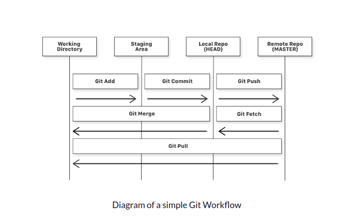
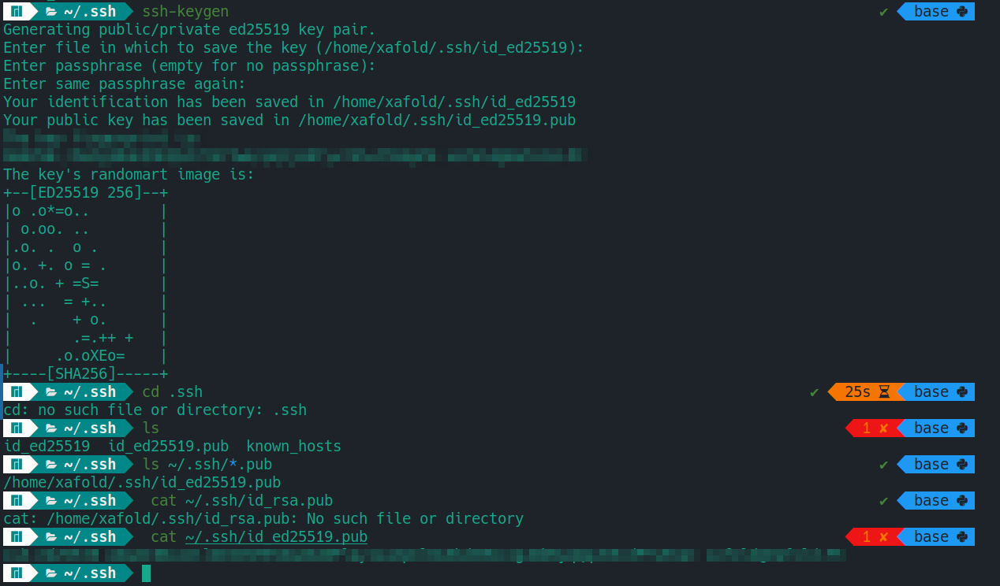
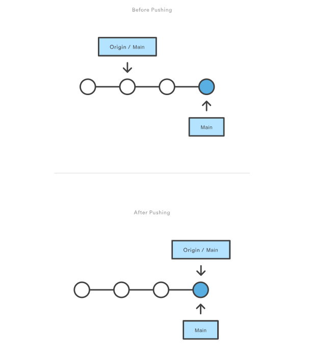
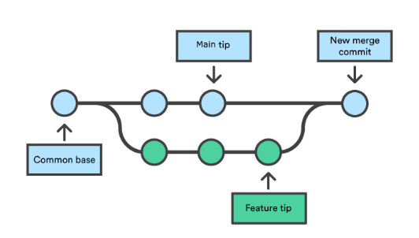
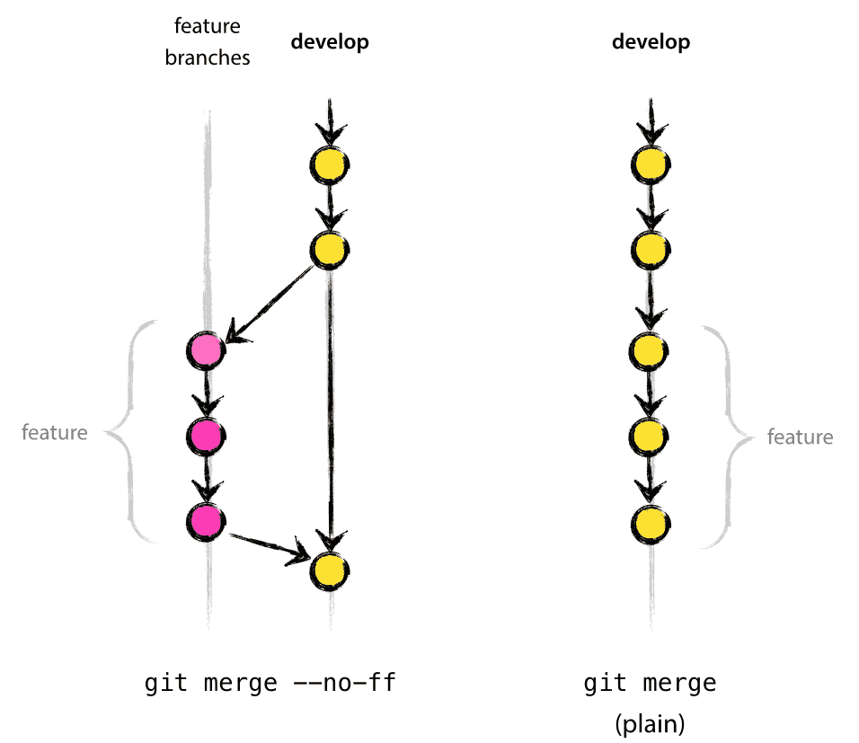
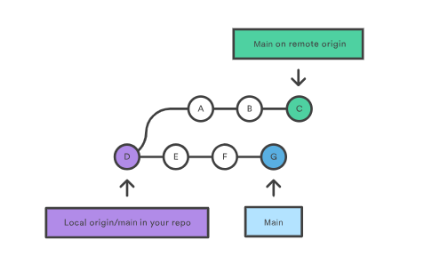
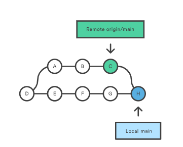
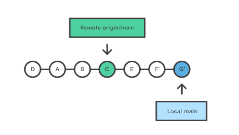

- [Introduction of Git](#introduction-of-git)
  - [But why do we use Git and what is version control?](#but-why-do-we-use-git-and-what-is-version-control)
  - [Git Version Control Workflow](#git-version-control-workflow)
  - [General Git Commands](#general-git-commands)
    - [Git Add](#git-add)
    - [Git Commit](#git-commit)
    - [Git Fetch](#git-fetch)
    - [Git Push](#git-push)
    - [Git Merge:](#git-merge)
    - [Git Pull](#git-pull)
- [References](#references)

# Introduction of Git

## But why do we use Git and what is version control?

**Why version Control tho?**

 1. It tracks all the changes over a file or set of files( ideally files inside folders)
 2. We can recall the specific version of that file later.
 3. Creates a managed flow of changes as versions and helps to roll back to version later.

What is Git?
Git is a version-control system for tracking changes in computer files and coordinating work on those files among multiple people. It doesn't necessarily don't rely on a single central server/computer for storing all the versions of a project's file.
**Git helps to keep track of the changes we make to our code**

Git also helps to synchronize code between multiple people. So teams collaborating on a project can work on different files or aspects of the project independently and later can merge those changes in a single branch usually Master.

## Git Version Control Workflow

- 

## General Git Commands

1. Initial Commands:

    `$ git help log` : get documentation for the git commands

    `$ git config --global user.name`

    `$ git config --global user.email you@yourdomain.example.com`: both are to introduce yourself to Git with name and public email address.

2. Importing the project:

    `$ cd project`

    ` $ git init `: Moving to the directory using cd command and initializing the local git repo.

- Special Case: When we clone the repo from the ssh we can first generate the ssh by following:

- 

3. When clonning the repo using the SHH:
   - After creating the SSH key we copy the key and add that ssh key into the gitlab profile.
  
   - We the copy the SSH link e.g: `git@repo.ekbana.info:2023-internship/machine-learning/utsavp.git` and clone the repo in local repo using command `git clone git@repo.ekbana.info:2023-internship/machine-learning/utsavp.git`

### Git Add 

* `$ git add`: After making the changes to the file and folders we first need to create the snapshot of changes and promote pending changes in the working directory, to the git staging area(i.e adding all the changes for commit )<br />
  
    - `git add <file_name>`: stages the changes of only that file.
  
    - `git add --all`: stages the changes of all the files in that directory.
  
    - `git add <directory>`: stages all the changes of that directory.
  
After creating the snapshot of the chnages in the files and directory and before we can see the 
  
### Git Commit

 * `$ git commit`: commits are created with the git commit command to capture the state of a project at that point in time.
  
    - `git commit`: Commit the staged snapshot but will prompt a text editor for commit message.
  
    - `git commit -a`: commit a snapshot of all changes in the working directory. This only includes modifications to tracked files (only those which have been added with `git add` ).
  
    - `git commit -m "commit message"`: immediately creates a commit with a commit message.
  
    - `git commit -am "commit message"`: combine the effect of both `git commit -m "commit message"` and `git commit -a`.
  
### Git Fetch

* `git fetch`: Fetch all of the branches from the repository. it also downloads all of the required commits and files from the other repo.
  
    - `git fetch <remote>`: Same as above fetchs and download the branches and all the required commits and file from repo.
  
    - `git fetch <remote> <branch>`: Same as the above command, but only fetch the specified branch.
  
    - `git fetch --all`: It will fetches all registered remotes and their branches:
  
### Git Push

* `git push`: Used to upload local repo content to remote repo. It transfers commits from your local repo to a remote repo.
  
    - `git push <remote> <branch>`: Push the specified branch to , along with all necessary commits and internal objects. Creates a local branch in destination repo.
  
    - `git push <remote> --force`:Same as above command, but force push even if it results in a non-fast-forward merge. <br/> **WARNING**: We absolutely don't use this command until we are certain of it.
  
* Standard method for pushing:
  ```git
    git checkout main
    git fetch origin main
    git rebase -i origin/main

    #Squash commits, fix up commit messages etc.

    git push origin main
  ```
  

### Git Merge:
Git merge will combine multiple sequences of commits into one unified history.<br >
`git merge` is used to combine two branches.

  

* **Note: Fast Forward Merge vs Non-Fast Forward Merge**:
    A non-fast-forward merge is a merge where the main branch had intervening changes between the branch point and the merge back to the main branch. In this case, a user can simulate a fast-forward by rebasing rather than merging. Rebasing works by abandoning some commits and creating new ones. [Link](https://support.atlassian.com/bitbucket-cloud/docs/git-fast-forwards-and-branch-management/)

  

### Git Pull

* `git pull`: Used to fetch and download content from a remote repository and immediately update the local repository to match that content.It first runs `git fetch` which downloads content from the specified remote repository. Then a `git merge` is executed to merge the remote content refs and heads into a new local merge commit.
  
    

    

    

    - `git pull <remote>`: Fetch specified remote copy of current branch and immediately merge it into local copy. Same as `git fetch ＜remote＞` followed by `git merge origin/＜current-branch＞`
  
    -  `git pull --no-commit <remote>`: 


# References

- [Learn Git](https://www.atlassian.com/git/tutorials)
- [Git Under 10 minutes](https://www.freecodecamp.org/news/learn-the-basics-of-git-in-under-10-minutes-da548267cc91/)
- [Git Documentation](https://git-scm.com/docs/gittutorial)