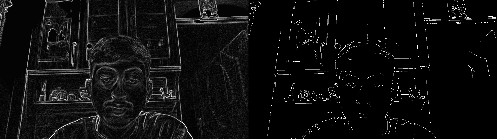

- [Edge Detection of Video Feed](#edge-detection-of-video-feed)
  - [Sobel Algorithm](#sobel-algorithm)
  - [Canny Algorithm](#canny-algorithm)
  - [Sobel vs Canny Algorithm](#sobel-vs-canny-algorithm)
- [References](#references)

# Edge Detection of Video Feed

Edge detection is a fundamental step in computer vision and image processing, so there was need to build algorithms that are accurate and robust. Several algorithms were developed for this purpose. Out of the available edge detection algorithms, Canny and Sobel techniques have the highest efficiency.

For edge detection in Video Feed from webcam or other video sources. We read the each frame of the video as frames i.e images and apply the algorithms like canny and sobel edge detection algorithm on them. And then we display those output frame as output video feed.

First we would implement the Sobel Edge Detection Algorithm:

## Sobel Algorithm

1. **Sobel Operator**

    The Sobel Operator is a discrete differentiation operator. It computes an approximation of the gradient of an image intensity function.The Sobel Operator combines Gaussian smoothing and differentiation. To obtain the Sobel derivative along the x-direction, we perform an outer product between a 1D Gaussian filter and the x derivative. The Sobel y filter is obtained by performing an outer product between the y derivative and a 1D Gaussian filter. The following figures illustrate the process:

    ||
    |:--:|
    |*Sobel-x filter*|

    ||
    |:--:|
    |*Sobel-y filter*|


2. **Formulation:**
   Assuming here image is denoted as $`I`$
   1. We calculate two derivatives:

        - Horizontal changes : This is computed by convolving I
       with a kernel $`G_x`$ with odd size. For example for a kernel size of 3, $`G_x`$ would be computed as:

        ```math
        G_{x}={\left[\begin{array}{l l l}{-1}&{0}&{+1}\\ {-2}&{0}&{+2}\\ {-1}&{0}&{+1}\end{array}\right]}*I
        ```

       - Vertical changes : This is computed by convolving I
       with a kernel $`G_y`$ with odd size. For example for a kernel size of 3, $`G_y`$ would be computed as:

        ```math
        G_{y}={\left[\begin{array}{l}-1&-2&-1\\0&0&0\\+1&+2&+1\end{array}\right]}*I
        ```

   2. At each point of the image we calculate an approximation of the gradient in that point by combining both results above:

    ```math
    G=\sqrt{G_{x}^{2}+G_{y}^{2}}
    ```

    Similarly we can also use:

    ```math
    G=|G_{x}|+|G_{y}
    ```

3. **Algorithm for Sobel Edge Detection:**

   a. Converting the image into grayscale.
   b. Applying Gaussian Blur filter to reduce noise.
   c. Convolving the gray image with Sobel-x filter.
   d. Convolving the gray image with Sobel-y filter.
   e. Calculating the gradient magnitude and direction.

4. **Output:**
    ||
    |:--:|
    |*Edge Detection Using Sobel's Algorithm*|

## Canny Algorithm

The Canny algorithm was introduced to further enhance edge detection. Its implementation is relatively more complicated than Sobel’s, but it has its advantages despite being complicated from Sobel algorithm.

1. **Algorithm for Canny Edge Detection:**
    The Canny algorithm can be summarized in five steps:

    1. **Blurring the grayscale image:**
        To blur the image, we use  Gaussian filter.

    2. **Finding the gradient magnitude and direction:**
        To calculate the image gradient, the Sobel operator is implemented just like above.

        ```math
        G_{x}={\left[\begin{array}{l l l}{-1}&{0}&{+1}\\ {-2}&{0}&{+2}\\ {-1}&{0}&{+1}\end{array}\right]}*I
        ```

        ```math
        G_{y}={\left[\begin{array}{l} -1 & -2 &-1 \\ 0 & 0 & 0 \\+1 & +2 & +1 \end{array}\right]}*I
        ```

        ```math
        where, \\ image \ is \ denoted \ as \ I
        ```

        Calculating the gradient strength and direction with:

        ```math
        \begin{array}{c}{{G=\sqrt{G_{x}^{2}+G_{y}^{2}}}}\\ {{\theta=\arctan(\frac{G_{y}}{G_{x}})}}\end{array}
        ```

        The direction is rounded to four angles: 0, 45, 90, and 135.

    3. **Non-maxima suppression:**
        This step is also known as edge thinning because it preserves the sharpest gradients and discards the others. The algorithm is implemented pixel-wise, given the gradient magnitude and direction. The gradient magnitude of the current pixel is compared with the magnitude of the neighboring pixels that point in the same direction.The algorithm for a given pixel $`[i,j]`$ is can be realized like this:

        ||
        |:--:|
        |*Non-Maxima Suppresion 1*|

        ||
        |:--:|
        |*Non-Maxima Suppresion 2*|
    4. **Hysteresis:**
        Canny does use two thresholds (upper and lower):

        1. If a pixel gradient is higher than the upper threshold, the pixel is accepted as an edge
        2. If a pixel gradient value is below the lower threshold, then it is rejected.
        3. If the pixel gradient is between the two thresholds, then it will be accepted only if it is connected to a pixel that is above the upper threshold.
2. **Output:**
    ||
    |:--:|
    |*Edge Detection Using Canny's Algorithm*|

## Sobel vs Canny Algorithm

The main advantages of the Sobel algorithm are that it is simple and more time-efficient. However, the edges are rough. On the other hand, the Canny technique produces smoother edges due to the implementation of Non-maxima suppression and thresholding. The downside of the Canny algorithm is that it is more complex and less time-efficient than Sobel.

From the following images differences between Sobel and Canny edge detection can be seen:

||
|:--:|
|*Output comparison of Sobel vs Canny*|

# References

- [Sobel vs. Canny Edge Detection Techniques: Step by Step Implementation](https://medium.com/@haidarlina4/sobel-vs-canny-edge-detection-techniques-step-by-step-implementation-11ae6103a56a)
- [Sobel Derivatives](https://vovkos.github.io/doxyrest-showcase/opencv/sphinx_rtd_theme/page_tutorial_sobel_derivatives.html)
- [Canny Edge Detector](https://vovkos.github.io/doxyrest-showcase/opencv/sphinx_rtd_theme/page_tutorial_canny_detector.html?highlight=canny)
- [Canny Edge Detection on Webcam](https://opencv-cpp.blogspot.com/2016/11/canny-edge-detection-on-webcam.html)

