- [Image Stitching](#image-stitching)
  - [Different Method for Image Stitching](#different-method-for-image-stitching)
  - [Image Stitching Process](#image-stitching-process)
    - [Feature Detection](#feature-detection)
    - [Feature Matching](#feature-matching)
    - [Homography Estimation](#homography-estimation)
    - [Image Wraping and Blending](#image-wraping-and-blending)
- [Refrences](#refrences)


# Image Stitching

Image stitching is a process of joining two or more images having an overlapping field or a common field. These common/overlapping fields are searched for common features within the two images and are referred for image stitching.

## Different Method for Image Stitching

1. **Direct**
    In this approach each pixel is taken into account and intensities of pixels are compared with each other.

    Because involvement of each pixel i.e. processing on each pixel, it becomes a very complex method. 
    <br>

2. **Feature based method**
    In this approach image features are extracted from two images, this process is performed on each image and independent of overlapping region.

    Feature finding process is basically looking for the corners in image pixels. Corners are more robust features than edges because they are translation and rotation invariant.These extracted corners are called “ feature key points”. Thus found key points should be uniquely identified every time, hence the information regarding pixel intensities surrounding it is also stored which is known as feature descriptors.
    <br>

## Image Stitching Process

The key concepts and techniques involved in image stitching include:

1. **Keypoint Detection**: Identifying distinctive features in images.
2. **Feature Descriptors**: Representing keypoints with numerical descriptors for matching.
3. **Feature Matching**: Finding correspondences between keypoints across images.
4. **Homography Estimation**: The transformation matrix that describes the geometric relationship between images.
5. **Image Warping and Blending**: Transforming images based on the estimated homography and merging images smoothly to create a seamless composite.

### Feature Detection

The goal of feature identification algorithms is to locate intriguing and recognizable focal areas in an image.
These keypoints could stand in for locations with substantial texture differences, corners, or edges.
For the purpose of detecting features, algorithms such as SIFT (Scale-Invariant Feature Transform), SURF (Speeded-Up Robust Features), and ORB (Oriented FAST and Rotated BRIEF) are frequently employed.
These algorithms take into account the keypoints’ scale and orientation to make them resistant to changes in scale and rotation. We used the **SIFT** alogirthm for feature detection so lets have some look at it.

1. **SIFT (Scale-Invariant Feature Transform)**

    SIFT is quite an involved algorithm. There are mainly four steps involved in the SIFT algorithm. We will see them one-by-one.

    1. **Scale-space peak selection**:
        1. **Scale-space:**
            The scale space of an image is a function L(x,y,σ) that is produced from the convolution of a Gaussian kernel(Blurring) at different scales with the input image. Scale-space is separated into octaves and the number of octaves and scale depends on the size of the original image. So we generate several octaves of the original image. Each octave’s image size is half the previous one.
            <br>

        2. **Blurring:**
            Within an octave, images are progressively blurred using the Gaussian Blur operator. Mathematically, “blurring” is referred to as the convolution of the Gaussian operator and the image. Gaussian blur has a particular expression or “operator” that is applied to each pixel.

            ```math
            L(x,y,\sigma)=G(x,y,\sigma)*I(x,y)
            ```

            where,G is the Gaussian Blur operator and I is an image.

            ```math
            G(x,y,\sigma)=\frac{1}{2\pi\sigma^{2}}e^{-(x^{2}+y^{2})/2\sigma^{2}}
            ```

            <br>

        3. **DOG(Difference of Gaussian kernel):**
            Now we use those blurred images to generate another set of images, the Difference of Gaussians (DoG). These DoG images are great for finding out interesting keypoints in the image. The difference of Gaussian is obtained as the difference of Gaussian blurring of an image with two different σ, let it be σ and kσ. This process is done for different octaves of the image in the Gaussian Pyramid.
            |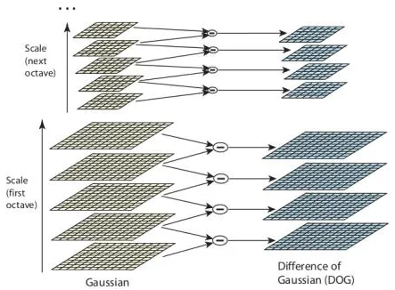|
            |:--:|
            |*Difference of Gaussian kernel*|

            <br>

        4. **Finding keypoints:**
            Finally now we calculate Laplacian of Gaussian approximations that are scale invariant.
            One pixel in an image is compared with its 8 neighbors as well as 9 pixels in the next scale and 9 pixels in previous scales. This way, a total of 26 checks are made. If it is a local extrema, it is a potential keypoint. It basically means that keypoint is best represented in that scale.
            |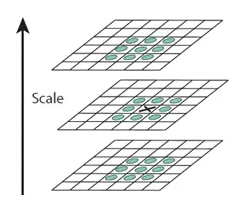|
            |:--:|
            |*Finding keypoints*|
        <br>

    2. **Keypoint Localization**:
        The keypoint filtering process involves eliminating keypoints that lie along edges or lack sufficient contrast. This is done similarly to the Harris Corner Detector, considering both low contrast and edge features. The algorithm employs Taylor series expansion of scale space to refine keypoint locations, rejecting those with intensity below a threshold (0.03). To address edges, a 2x2 Hessian matrix is used to compute principal curvature, aiding in the removal of edge-related keypoints.
        |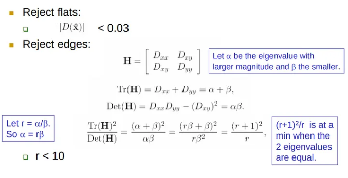|
        |:--:|
        |*Keypoint Localization*|

        <br>

    3. **Orientation Assignment**:
        Legitimate keypoints are obtained and tested for stability. To achieve rotation invariance, orientations are assigned by calculating gradient magnitude and direction in a neighborhood around each keypoint. An orientation histogram with 36 bins is created, and the gradient contributions in each bin are determined based on magnitude.Let's say the gradient direction at a certain point is 18.759 degrees, then it will go into the 10–19-degree bin. The peak in the histogram corresponds to the dominant orientation, making keypoints rotationally invariant.
        |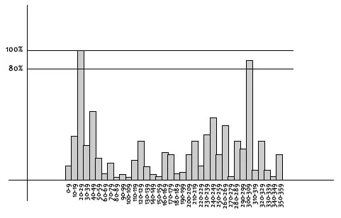|
        |:--:|
        |*Example Histogram*|

        <br>

    4. **Keypoint descriptor**:
        Next is to compute a descriptor for the local image region about each keypoint that is highly distinctive and invariant as possible to variations such as changes in viewpoint and illumination.
        To do this, a 16x16 window around the keypoint is taken. It is divided into 16 sub-blocks of 4x4 size.
        |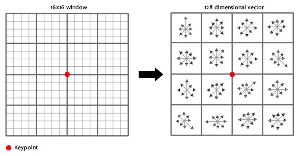|
        |:--:|
        |*Keypoint Descriptor 1*|

        For each sub-block, 8 bin orientation histogram is created.
        |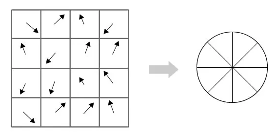|
        |:--:|
        |*Keypoint Descriptor 2*|

        Keypoint descriptors are formed using 4x4 descriptors over a 16x16 sample array, resulting in a 4x4x8 feature vector with 128 bin values. However, this introduces complications:

        1. **Rotation Dependence:** Gradient orientations are made relative to the keypoint's orientation, ensuring rotation independence.

        2. **Illumination Dependence:** To achieve illumination independence, values above 0.2 in the feature vector are thresholded, changed to 0.2, and the vector is then normalized.

        These steps yield a finalized keypoint descriptor that is both rotationally invariant and illumination independent.
    <br>

2. **Code and Output:**

    ```c++
    // Initializing the SIFT feature detector and extractor
    Ptr<SIFT> sift = SIFT::create();

    // Detecting the  keypoints and compute descriptors for both the input images
    vector<KeyPoint> keypoints1, keypoints2;
    Mat descriptors1, descriptors2;

    sift->detectAndCompute(image1, noArray(), keypoints1, descriptors1);
    sift->detectAndCompute(image2, noArray(), keypoints2, descriptors2);

    // Drawing the keypoints on both the input images
    Mat image1_keypoints, image2_keypoints;
    drawKeypoints(image1, keypoints1, image1_keypoints);
    drawKeypoints(image2, keypoints2, image2_keypoints);
    ```

    We calculate descriptors for both pictures using the `detectAndCompute` method of the SIFT object to identify keypoints. While the descriptors are kept in the `descriptors1` and `descriptors2` variables, the keypoints are kept in the `keypoints1` and `keypoints2` variables. <br>
    The `drawKeypoints` function is used to draw the keypoints on the images in order to view them. The variables `image1_keypoints` and `image2_keypoints` contain the keypoints for the final images.

    |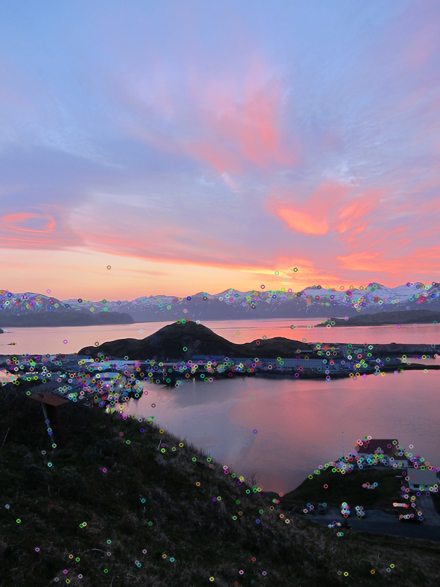|
    |:--:|
    |*Keypoints on the Image1*|

    |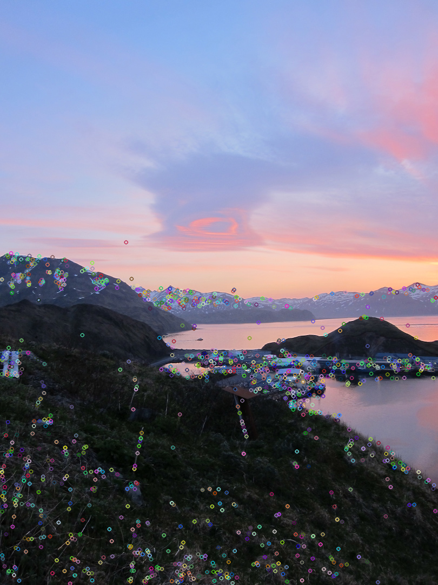|
    |:--:|
    |*Keypoints on the Image2*|

### Feature Matching

A crucial stage in image stitching is feature matching, which creates correspondences between keypoints in various images. In order to ensure accurate alignment and registration of the images, it seeks to identify keypoints that match based on their descriptors. Numerous feature matching methods, including FLANN (Fast Library for Approximate Nearest Neighbors) based matching and Brute-Force Matching, is available on OpenCV.

We used the Brute-Force Matching for our implementation:

1. **Brute-force matching**

    1. Introduction to Brute-force matching:
       - A straightforward and easy method of feature matching is brute-force matching.
       - Every descriptor from one image is compared to every descriptor from the second image.
       - Calculating distances or similarities between descriptors (such the Euclidean distance or cosine similarity) is a step in the matching process.
       - The OpenCV `BFMatcher` class allows for the use of brute-force matching.
       - Even though it is straightforward, it can be computationally expensive, particularly for big feature sets.
    <br>

 2. **Code and Output:**

    ```c++
    // Initializing the feature matcher using brute-force matching and matching the descriptor
    BFMatcher bf(NORM_L2, true);
    vector<DMatch> matches_bf;
    bf.match(descriptors1, descriptors2, matches_bf);

    // Sorting the matches by distance (lower distance are better)
    auto compareMatches = [](const DMatch& a, const DMatch& b) {
        return a.distance < b.distance;
    };
    sort(matches_bf.begin(), matches_bf.end(), compareMatches);

    // Drawing the top 40 matches
    int num_matches = 40;
    vector<char> matches_mask(matches_bf.size(), 0);  // Initializing the mask with zeros(for top 40 matches)
    for (int i = 0; i < num_matches; ++i) {
        matches_mask[i] = 1;
        }
    Mat image_matches_bf;
    drawMatches(image2, keypoints1, image1, keypoints2, matches_bf, image_matches_bf, Scalar::all(-1),
                    Scalar::all(-1), matches_mask, DrawMatchesFlags::NOT_DRAW_SINGLE_POINTS);
    ```

    Starting with the `NORM_L2 , true` for feature matching, we initialize the brute-force matcher using `BFMatcher bf(NORM_L2, true)`. The `match` function is then used to look for similarities between the two images’ descriptions. On the basis of distance, the matches are arranged.<br>
    We draw the matches on the images using the `drawMatches` function to visualize the matches. For clarity, we only display the first N matches (as determined by num_matches).

    |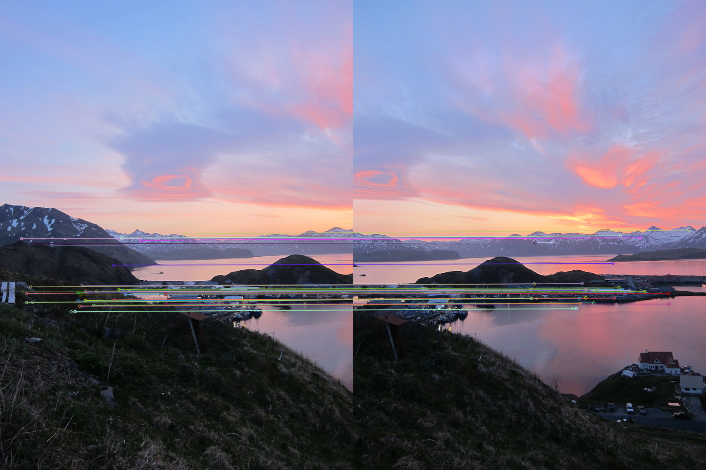|
    |:--:|
    |*Brute Force Matching*|

### Homography Estimation

Fundamental step of Homography Estimation is essential for aligning and integrating the images. In order to transfer similar points from one image to another, a homography matrix is used to express the transformation between two image planes. With the help of matched keypoints received from feature matching, OpenCV offers techniques for estimating the homography matrix.

1. **Estimating Homography Matrix using Matched Keypoints**

    1. The `findHomography` function in OpenCV can be used to calculate the homography matrix.
    2. The estimated homography matrix is returned by the `findHomography` method, which accepts the matching keypoints as input.
    3. [**RANSAC (Random Sample Consensus)**](https://medium.com/mlearning-ai/outlier-detection-using-the-ransac-algorithm-de52670adb4a), a reliable estimate procedure, is used to handle outliers and provide an accurate homography matrix.
    4. **RANSAC** estimates the homography matrix by picking a subset of the matched keypoints iteratively. The optimal homography matrix with the most inliers is chosen after assessing the number of inliers that suit the predicted model.

2. **Code and Output**:

    ```c++
    // Converting keypoints to Matrix for findHomography function
    Mat src_points_mat(source_points);
    Mat dst_points_mat(destination_points);

   // Estimating the homography matrix using RANSAC algorithm
    Mat homography = findHomography(src_points_mat, dst_points_mat, RANSAC, 5.0);

    // Print out the homography matrix
    cout << "Estimated Homography Matrix:" << endl;
    for (int i = 0; i < homography.rows; ++i) {
        for (int j = 0; j < homography.cols; ++j) {
            cout << homography.at<double>(i, j) << " ";
        }
        cout << endl;
    }
    ```

    ```output
    <<Output
    Estimated Homography Matrix:
    0.710021 0.0600063 315.889 
    -0.209134 0.907434 50.0419 
    -0.000344528 -6.23819e-06 1 
    ```

    The estimated Homography matrix obtained from above method is:

    ```math
    {\mathrm{H}} = \left[{\begin{array}{cc} 0.710021 & 0.0600063 & 315.889 \\ -0.209134 & 0.907434 & 50.0419  \\ -0.000344528 & -6.23819e-06 & 1 \end{array}}\right]
    ```

    |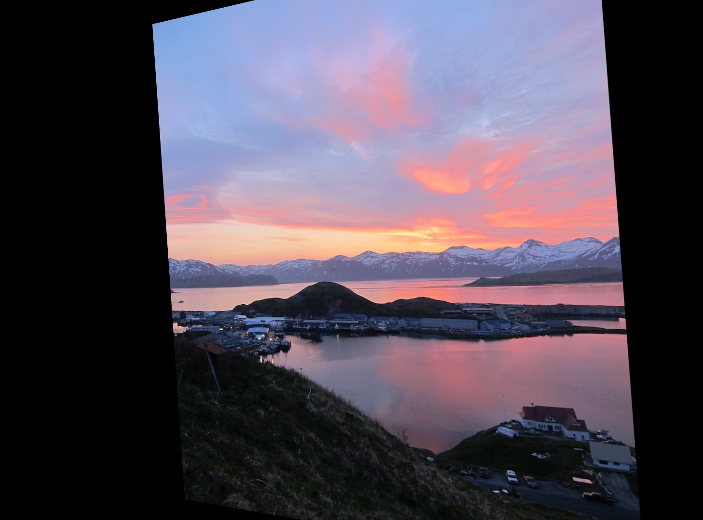|
    |:--:|
    |*Image Obtained after Homography Transformation*|

### Image Wraping and Blending

1. **Image Wraping and Blending Steps:**
   1. *Warping Images using the Estimated Homography*
       1. After estimating the homography matrix, we may use it to convert one image’s coordinate system to that of the other.
       2. The `warpPerspective` function in OpenCV allows you to warp an image by applying the homography transformation.
       3. The estimated homography matrix, the size of the output picture, and the input image are all input parameters for the function.
       4. The size of the output image will match that of the reference image (or destination image).

   2. *Blending the Warped Images to Create a Seamless Composite*
       1. To produce a smooth composite image, we must blend the warped images together.
       2. Simple picture concatenation could produce obvious seams or jarring changes in the images.
       3. Several blending methods, including [**Alpha Blending**, Feathering, and Multi-Band blending](https://courses.engr.illinois.edu/cs498dwh/fa2010/lectures/lecture%2017%20-%20photo%20stitching.pdf), can be used to produce a smoother blending effect.
       4. To achieve a seamless and realistic outcome, these strategies try to progressively transition the pixel intensities between the images.
       5. For this task we have used **Alpha Blending** for blending purpose.

2. **Code and Final Output:**

    ```c++
    // Calculating the Size for the Final Stitched Image
    int width, height;
    width = image1.cols + image2.cols*0.8;
    height = image2.rows;

    // Creating a Black Image with Size of the Final Stitched Image
    Mat result = Mat::zeros(height, width, image1.type());

    // Applying the perspective transformation to train (transformed image) image
    warpPerspective(image1, result, homography, result.size());
    Mat result_stitch;
    result.copyTo(result_stitch);

    // Copying the contents of query image to the appropriate region in the result image
    Mat roi(result_stitch, Rect(0, 0, image2.cols, image2.rows));
    image2.copyTo(roi);

    // Check sizes before blending
    cout << "Size of result: " << result.size() << endl;
    cout << "Size of image2: " << image2.size() << endl;

    // Resizing the image2 with the size of the result image
    resize(image2, image2, result.size());
    double alpha = 0;
    // Creating a new Blended image and apllying the Alpha Blending
    Mat blended_image;
    addWeighted(result, alpha, image2, 1-alpha, 0, blended_image);
    }
    ```

    <br>

    |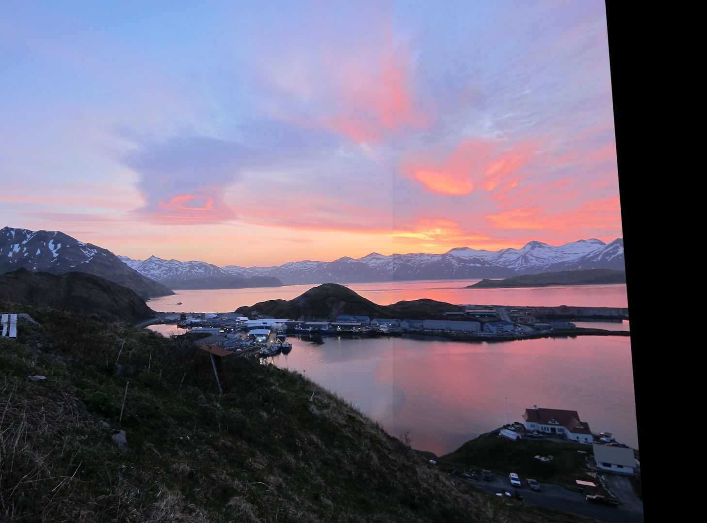|
    |:--:|
    |*Final Stitched Image*|

    <br>

    |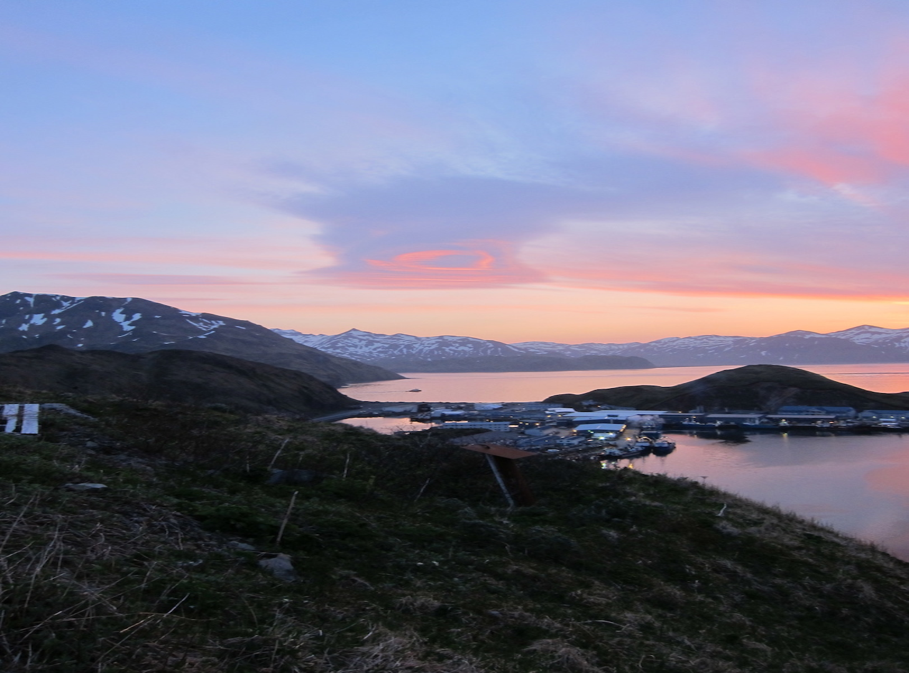|
    |:--:|
    |*Final Blended Image*|

# Refrences

- [Image Stitching using OpenCV — A Step-by-Step Tutorial](https://medium.com/@paulsonpremsingh7/image-stitching-using-opencv-a-step-by-step-tutorial-9214aa4255ec)
- [Image Stitching with OpenCV C++](https://medium.com/@pavanhebli/image-stitching-with-opencv-c-3e42a626c75c)
- [Image Stitching and Blending Slide](https://courses.engr.illinois.edu/cs498dwh/fa2010/lectures/lecture%2017%20-%20photo%20stitching.pdf)
- [Introduction to SIFT( Scale Invariant Feature Transform)](https://medium.com/@deepanshut041/introduction-to-sift-scale-invariant-feature-transform-65d7f3a72d40)
- [Outlier detection using the RANSAC algorithm](https://medium.com/mlearning-ai/outlier-detection-using-the-ransac-algorithm-de52670adb4a)
- [Stitching and Blending](https://web.stanford.edu/class/cs231m/lectures/lecture-5-stitching-blending.pdf)