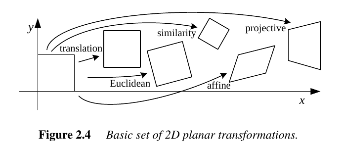
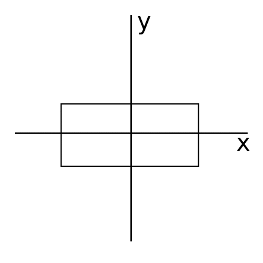
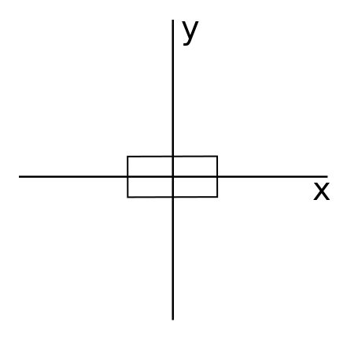
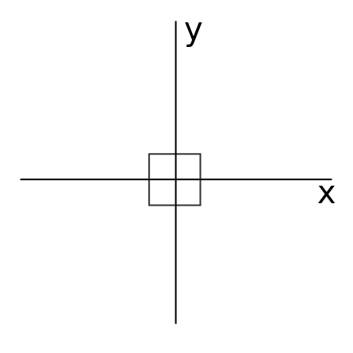
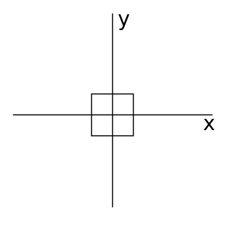
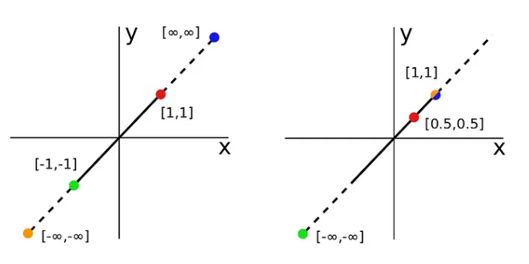
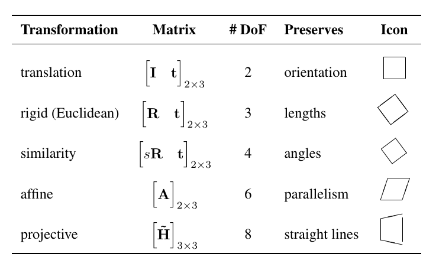

- [2D transformation of Images](#2d-transformation-of-images)
  - [Different 2D planar transformations](#different-2d-planar-transformations)
    - [Translation Transformation](#translation-transformation)
    - [Euclidean Transformation (Rotation + translation)](#euclidean-transformation-rotation--translation)
    - [Similarity Transformation (Rotation + scaling)](#similarity-transformation-rotation--scaling)
    - [Affine Transformation (Rotation + scaling)](#affine-transformation-rotation--scaling)
    - [Projective Transformation (homography)](#projective-transformation-homography)
      - [Elation](#elation)
  - [Hierarchy of 2D transformations](#hierarchy-of-2d-transformations)
- [References](#references)


# 2D transformation of Images

Transformation means changing some graphics into something else by applying rules. We can have various types of transformations such as translation, scaling up or down, rotation, shearing, etc. When a transformation takes place on a 2D plane, it is called 2D transformation.

1. Homogenous Coordinates:
    If we need to do multiple transformation in sequence or in chain like doing translation followed by rotation and scaling. We need to follow these steps:
      * Translate the coordinates, 
      * Rotate the translated coordinates, and then
      * Scale the rotated coordinates to complete the composite transformation.
  
    Using a 2 × 3 matrix results in a more compact notation, whereas using a full-rank 3 × 3 matrix (which can be obtained from the 2 × 3 matrix by appending a $`\left[0^{T}\ 1\right]`$ row ) makes it possible to chain transformations using matrix multiplication as well as to compute inverse transforms. 

2. Translation:
   A translation moves an object to a different position on the screen. We can translate a point in 2D by adding translation matrix($`\left[t_x, t_y \right ]`$) to the original matrix $`\left[X, Y \right ]`$ to get the translated matrix $`\left[X', Y' \right ]`$.

    2D translations can be written as $`\mathbf{x}^{\prime}=\mathbf{x}+\mathbf{t}`$, 
    <br>In matrix form as:
    ```math
    \mathbf{x}^{\prime}=\left[\mathbf{I}\quad\mathbf{t}\right]\overline{\mathbf{x}} ,
    ```
    where I is the (2 × 2) identity matrix or
    ```math
    \mathbf{\overline{\mathbf{x}} }^{\prime} = \left[\begin{array}{cc}I & t \\ 0^{T} & 1 \end {array}\right] \overline{\mathbf{x}},
    ```

3. Rotation:
    In rotation, we rotate the object at particular angle θ 
    from its origin. We can rotate in 2D by multipying rotation matrix i.e 
    $`\left[{\begin{array}{cc}{cos\theta}&{-sin\theta}\\ {sin\theta}&{cos\theta}\end{array}}\right]`$ <br >to the original matrix $`\left[X, Y \right ]`$ to get the new rotated matrix $`\left[X', Y' \right ]`$.

4. Scaling:
    To change the size of an object, scaling transformation is used. In the scaling process, we can either expand or compress the dimensions of the object. 
    ```math
    \mathbf{x}^{\prime}=\left[\mathbf{s}\quad\mathbf{t}\right]\overline{\mathbf{x}} ,
    ```
    Scaling can be achieved by multiplying the original matrix with the scaling factor matrix i.e 
    $`\left[{\begin{array}{cc}{s_x}& 0 \\ 0 & {s_y}\end{array}}\right]`$ to the original matrix $`\left[X, Y \right ]`$ to get the new scaled matrix $`\left[X', Y' \right ]`$.

5. Shear:
    A transformation that slants the shape of an object is called the shear transformation. There are two shear transformations X-Shear and Y-Shear. One shifts X coordinates values and other shifts Y coordinate values. However; in both the cases only one coordinate changes its coordinates and other preserves its values.
    ```math
    \mathbf{x}^{\prime}=\left[\mathbf{sh}\quad\mathbf{t}\right]\overline{\mathbf{x}} ,
    ```
    We can scale in 2D by sclaing matrix i.e 
    $`\left[{\begin{array}{cc} 1 & {sh_x} \\ {sh_y} & 1\end{array}}\right]`$ to the original matrix $`\left[X, Y \right ]`$ to get the new sheared matrix $`\left[X', Y' \right ]`$.

## Different 2D planar transformations

||
|:--:|
|*Basic set of 2D planar transformation*|

### Translation Transformation

2D translation can be written as $`\mathbf{x}^{\prime}=\mathbf{x}+\mathbf{t}`$, 
<br>In matrix form as:
```math
\mathbf{x}^{\prime}=\left[\mathbf{I}\quad\mathbf{t}\right]\overline{\mathbf{x}} ,
```
where,
```math
t = \left[{\begin{array}{cc}t_x \\ t_y \end{array}}\right] 
```
where I is the (2 × 2) identity matrix or
```math
\mathbf{\overline{\mathbf{x}} }^{\prime} = \left[\begin{array}{cc}I & t \\ 0^{T} & 1 \end {array}\right] \overline{\mathbf{x}},
```
But in homogenous matrix,
```math 
\left[\begin{array}{l}x^{\prime} \\ y^{\prime}\end{array}\right] 
= \left[\begin{array}{cc}t_x \\ t_y \end {array}\right] +
\left[\begin {array}{l} x \\ y \end{array}\right]
```

**1. Output:**

||
|:--:|
|*Original vs Transformed Image after Translation transformation*|

### Euclidean Transformation (Rotation + translation)

This transformation is also known as 2D rigid body motion or the 2D Euclidean transformation (since Euclidean distances are preserved). It can be written as <br > $`\mathbf{x}^{\prime}=\mathbf{R}\mathbf{x}+\mathbf{t}`$ or 
```math
\mathbf{x}^{\prime}=\left[\mathbf{R}\quad\mathbf{t}\right]\overline{\mathbf{x}}, 
``` 
where, 
```math
R = \left[{\begin{array}{cc}{cos\theta}&{-sin\theta}\\ {sin\theta}&{cos\theta}\end{array}}\right] 
```
is an orthonormal rotation matrix with $`\mathbf{RR}^{T}=\mathbf{I} \ and \ |\mathbf{R}|=1.`$

Similarly, 
```math 
\left[\begin{array}{l}x^{\prime} \\ y^{\prime} \end{array}\right]  = \left[{\begin{array}{cc}{cos\theta}&{-sin\theta}\\ {sin\theta}&{cos\theta}\end{array}}\right] \left[\begin{array}{l}x^{\prime} \\ y^{\prime} \end{array}\right] + \left[\begin{array}{l} t_x\\ t_y \end{array}\right]
```

But in homogenous matrix all these operations can be encapsulated into one matrix,
```math
\left[\begin{array}{l}x^{\prime} \\ y^{\prime}\end{array}\right] 
= \left[\begin{array}{cc}\varepsilon \cos \theta & -\sin \theta & t_x \\ \varepsilon \sin \theta & \cos \theta & t_y \end {array}\right]
\left[\begin {array}{l} x \\ y \end{array}\right]
```

where ε = ±1. If ε = 1, then the isometry is orientation preserving and is a Euclidean transformation. On the other hand, if ε = -1, then the isometry reverses orientation. An example is a transformation which performs a simple reflection.

||
|:--:|
|*Eucleadian transformation GIF*|

**1. Output:**

||
|:--:|
|*Original vs Transformed Image after Eucleadian transformation*|

### Similarity Transformation (Rotation + scaling)

This transformation is combination transformation just like eucledian but with scaling factor. It can be written as <br > $`\mathbf{x}^{\prime}=\mathbf{sR}\mathbf{x}+\mathbf{t}`$ or 
```math
\mathbf{x}^{\prime}=\left[\mathbf{sR}\quad\mathbf{t}\right]\overline{\mathbf{x}}, 
```
where, 
```math
s = \left[{\begin{array}{cc}s_x & 0 \\ 0 & s_y \end{array}}\right] 
```
Similarly, 
```math 
\left[\begin{array}{l}x^{\prime} \\ y^{\prime} \end{array}\right]  = \left[{\begin{array}{cc}\varepsilon s cos\theta & -s sin\theta \\ \varepsilon s sin\theta & s cos\theta \end{array}}\right] \left[\begin{array}{l}x^{\prime} \\ y^{\prime} \end{array}\right] + \left[\begin{array}{l} t_x\\ t_y \end{array}\right]
```

But in homogenous matrix all these operations can be encapsulated into one matrix,
```math
\left[\begin{array}{l}x^{\prime} \\ y^{\prime}\end{array}\right] 
= \left[\begin{array}{cc}\varepsilon s cos\theta & -s sin\theta & t_x \\ \varepsilon s \sin \theta & s \cos \theta & t_y \end {array}\right]
\left[\begin {array}{l} x \\ y \end{array}\right]
```
||
|:--:|
|*Example Similarity transformation GIF*|

**1. Output:**

||
|:--:|
|*Original vs Transformed Image after Similarity transformation (Scaled up 1.5 time)*|

### Affine Transformation (Rotation + scaling)

This transformation is combination transformation i.e rotation, scaling, shearing, translation etc. It can be written as <br > $`\mathbf{x}^{\prime}=\mathbf{A}\mathbf{x}+\mathbf{t}`$ or 
```math
\mathbf{x}^{\prime}=\left[\mathbf{A}\quad\mathbf{t}\right]\overline{\mathbf{x}}, 
```
where A is an arbitrary 2 × 3 matrix, i.e.
```math
A = \left[{\begin{array}{cc}a_{00} & a_{01} & a_{02} \\ a_{10} & a_{11} & a_{12} \\  \end{array}}\right]
```
But in homogenous matrix all these operations can be encapsulated into one matrix,
```math
\left[\begin{array}{l}x^{\prime} \\ y^{\prime}\end{array}\right] 
= \left[{\begin{array}{cc}a_{00} & a_{01} & a_{02} \\ a_{10} & a_{11} & a_{12} \\  \end{array}}\right]
\left[\begin {array}{l} x \\ y \end{array}\right]
```
We can in fact perform singular value decomposition (SVD), and re-write the matrix A in the following form:
```math 
\begin{array}{c}A=\left[\begin{array}{cc}\cos \theta & -\sin \theta \\ \sin \theta & \cos \theta\end{array}\right]\left[\begin{array}{cc}\cos (-\Phi) & -\sin (-\Phi) \\ \sin (-\Phi) & \cos (-\Phi)\end{array}\right] \cdots \\ \cdots\left[\begin{array}{cc}\lambda_1 & 0 \\ 0 & \lambda_2\end{array}\right]\left[\begin{array}{cc}\cos \Phi & -\sin \Phi \\ \sin \Phi & \cos \Phi\end{array}\right]\end{array}
```
The first two and the last one are simple rotation matrices and the third matrix represents simple scaling by λ1 and λ2 in the x and y directions respectively.

||
|:--:|
|*Example Affine transformation GIF*|

**1. Output:**

||
|:--:|
|*Original vs Transformed Image after Affine transformation*|

The Affine transformation we have done here is simple translation in x and y direction by 50 and 40 respectively and 0.8 shearing in x direction and 1.2 times scaling in both x and y direction. These operation can be represented in a single Affine transformation matrix A as:
```math
A = \left[{\begin{array}{cc} 1.2 & 0.8 & 50 \\ 0 & 1.2 & 40 \\  \end{array}}\right]
```

### Projective Transformation (homography)

This transformation, also known as a perspective transform or homography, operates on homogeneous coordinates, $`\tilde{x}^{\prime}=\tilde{\mathrm{H}}\tilde{x}`$,

where, H̃ is an arbitrary 3 × 3 matrix.
```math
\tilde{\mathrm{H}} = \left[{\begin{array}{cc}h_{00} & h_{01} & h_{02} \\ h_{10} & h_{11} & h_{12} \\ h_{20} & h_{21} & h_{22} \end{array}}\right]
```

Note that $`\tilde{\mathrm{H}}`$ is homogeneous i.e., it is only defined up to a scale, and that two $`\tilde{\mathrm{H}}`$ matrices that differ only by scale are equivalent. The resulting homogeneous coordinate $`\tilde{x}^{\prime}`$ must be normalized in order to obtain an in homogeneous result $`x`$, i.e.,
```math
x^{\prime}=\frac{h_{00}x+h_{01}y+h_{02}}{h_{20}x+h_{21}y+h_{22}}\quad\mathrm{and}\quad y^{\prime}=\frac{h_{10}x+h_{11}y+h_{12}}{h_{20}x+h_{21}y+h_{22}}.
```
The transformation can be represented in matrix form as:
```math
\left[\begin{array}{c}x^{\prime} \\ y^{\prime} \\ 1\end{array}\right]=\left[\begin{array}{lll}h_{00} & h_{01} & h_{02} \\ h_{10} & h_{11} & h_{12} \\ h_{20} & h_{21} & v\end{array}\right]\left[\begin{array}{l}x \\ y \\ 1\end{array}\right]
```
Here v=1 or 0, this links back to the argument about only needing eight unique values in the matrix. The general projectivity can also be written in block form as follows:
```math
x^{\prime}=H_p x=\left[\begin{array}{cc}A & t \\ v^T & v\end{array}\right] X
```
The upper left 4 elements are affine component A, the upper right 2 elements are translation component t, and the new lower left 2 elements are “elation” component $`v^{T}`$.

||
|:--:|
|*Example Projective transformation GIF*|

#### Elation

The elation matrix is analyzed through matrix multiplication, resulting in scalar equations for Euclidean 2D points. 
Elation matrix as:
```math
\mathbf{X}^{\prime}=H_E \mathbf{X}=\left[\begin{array}{ccc}1 & 0 & 0 \\ 0 & 1 & 0 \\ v_1 & v_2 & v\end{array}\right]\left[\begin{array}{l}x \\ y \\ 1\end{array}\right]
```

Evaluating the matrix multiplication:
```math 
{\mathrm{~}}x^{\prime}\ =\left[\begin{array}{cc}x \\ y \\ v_{2}x+v_{2}y+v \end{array}\right]
```
For arbitrary values of v1 and v2, we get the following two scalar equations for Euclidean 2D points:
```math
\begin{array}{l}x^{\prime}=\frac{x}{v_1 x+v_2 y+v} \\ y^{\prime}=\frac{y}{v_1 x+v_2 y+v}\end{array}
```

The equations reveal that elations scale points toward or away from the origin, with the scaling factor being a linear function of the initial x and y values.


One notable feature of elations is the ability to move points between the infinite and finite realms. When specific values are assigned ($`v_x = 1, v_y = 0, v = 1`$), the elation operation maps the point [∞,∞] to [1,1], demonstrating the transformation of points from infinite to finite.
```math
\begin{array}{r c l}{{x^{'}=}}&{{\frac{x}{x+1}}}\\ {{}}&{{}}&{{}}\\ {{y^{'}=}}&{{\frac{y}{x+1}}}\end{array}
```

Similarly, the point [-1,-1] is mapped to [-∞,-∞], showcasing the capacity of elations to move points from the finite to infinite realm. This unique property sets elations apart from other transformation types. Additionally, the text mentions that elations can project points to non-infinite locations, exemplified by the mapping of [1,1] to [0.5,0.5].


||
|:--:|
|*Operations of Elation*|

**1. Output:**

||
|:--:|
|*Original vs Transformed Image after Projective transformation*|

The Projective transformation we have done here is combination of three transformations i.e. shearing, scaling, elation.
```math
Sh = \left[{\begin{array}{cc} 1 & 0.2 & 0 \\ 0.2 & 1 & 0 \\  0 & 0 & 1\end{array}}\right]
```
```math
s = \left[{\begin{array}{cc} 0.7 & 0 & 0 \\ 0 & 0.7 & 1 \\  0 & 0 & 1\end{array}}\right]
```
```math
v = \left[{\begin{array}{cc} 1 & 0 & 0 \\ 0 & 1 & 0 \\  0.0008 & 0.0008 & 1 \end{array}}\right]
```
and we obtained the above result/output.

## Hierarchy of 2D transformations

Hierarchy of 2D coordinate transformations, listing the transformation name, its matrix form, the number of degrees of freedom, what geometric properties it preserves, and a mnemonic icon. Each transformation also preserves the properties listed in the rows below it, i.e., similarity preserves not only angles but also parallelism and straight lines. The 2 × 3 matrices are extended with a third $`\left[0^{T}\ 1\right]`$ row to form a full 3 × 3 matrix for homogeneous coordinate transformations.

||
|:--:|
|*Hierarchy of 2D transformations*|

# References

- [Part I: Projective Geometry in 2D](https://medium.com/@unifyai/part-i-projective-geometry-in-2d-b1ca26d5fa2a)
- [Part II: Projective Transformations in 2D](https://medium.com/@unifyai/part-ii-projective-transformations-in-2d-2e99ac9c7e9f)
- [Image Translation and Rotation Using OpenCV](https://learnopencv.com/image-rotation-and-translation-using-opencv/)
- [Degrees of Freedom in Affine Transformation and Homogeneous Transformation](https://math.stackexchange.com/questions/2866077/degrees-of-freedom-in-affine-transformation-and-homogeneous-transformation)
- [2D Transformation](https://www.tutorialspoint.com/computer_graphics/2d_transformation.htm#:~:text=Transformation%20means%20changing%20some%20graphics,it%20is%20called%202D%20transformation.)