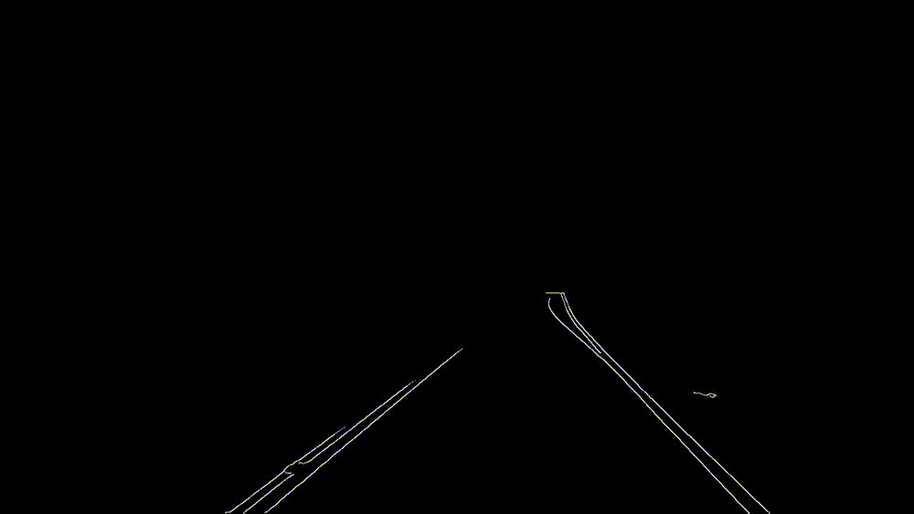
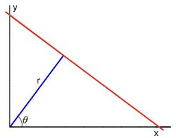
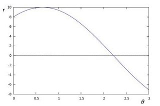
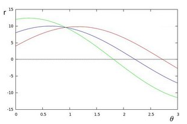
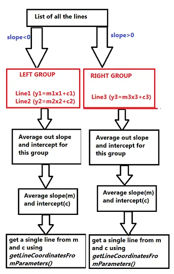

- [Lane Detection on Video Feed](#lane-detection-on-video-feed)
  - [Original Input Video Feed](#original-input-video-feed)
  - [Step 1: Edge Detection](#step-1-edge-detection)
  - [Step 2: Creating ROI(Region of Interest)](#step-2-creating-roiregion-of-interest)
  - [Step 3: Getting Lines using Hough Transform](#step-3-getting-lines-using-hough-transform)
    - [Hough Transform](#hough-transform)
  - [Step 4: Getting Line Cordinates and Displaying Lines](#step-4-getting-line-cordinates-and-displaying-lines)
  - [Step 5: Getting Smooth line from Hough Lines](#step-5-getting-smooth-line-from-hough-lines)
  - [Step 6: Creating the ROI of the Lane (Final Step)](#step-6-creating-the-roi-of-the-lane-final-step)
- [Refrences](#refrences)


# Lane Detection on Video Feed

## Original Input Video Feed

||
|:--:|
|*Original Feed*|

## Step 1: Edge Detection

From the previous task we have done and for optimal edge detection we can use Canny Algorithm as edge detection algorithm for this task.

But first convert the image as grayscale and add `GaussianBlur` and then use OpenCV's `Canny` function for edge detection.

```c++
    cvtColor(image, imgGrayscale, COLOR_BGR2GRAY);
    GaussianBlur(imgGrayscale,imgBlurred,Size(5, 5),1.8);
    Canny(imgBlurred,imgCanny,50,150);
```

- **Output**

    ||
    |:--:|
    |*Output after Canny Detection*|

## Step 2: Creating ROI(Region of Interest)

To keep a car on the we can only consider on the next 100 -150 meteres of your current road . Also, we don't care about the road on another side of the divider. So, this can be our **Region of Interest(ROI)** So we show only the region which would help us in finding the lane.

```c++
Mat region_of_interest(Mat &image){
    int height = image.rows;
    int width = image.cols;

    // Defining the triangular ROI
    vector<Point> triangle;
    triangle.push_back(Point(300, height));
    triangle.push_back(Point(width, height));
    triangle.push_back(Point(width - 500, static_cast<int>(height / 1.8)));

    Mat black_image = Mat::zeros(image.size(), image.type());
    // Creating a mask
    fillPoly(black_image, triangle, 255); 
    // Applying the mask to the original image
    Mat masked_image;
    bitwise_and(image, black_image, masked_image);

    return masked_image;
}
```

- **Output**

    ||
    |:--:|
    |*Output after creating ROI*|

## Step 3: Getting Lines using Hough Transform

This step would be to pass the ROI to get all the straight lines in the image. The `cv2.HoughLinesP()` helps us to achieve this. This function returns a list of all the straight lines that it can find in the input image. Each line is represented by $`[x1, y1, x2, y2]`$.

### Hough Transform

1. **Hough Line Transform:**

   1. The Hough Line Transform is a transform used to detect straight lines.
   2. To apply Hough Transform, first an edge detection pre-processing is needed.
<br>

2. **Working Principle:**

   1. A line in the image space can be expressed with two variables:
       1. In the Cartesian coordinate system: Parameters: $`(m,b)`$`.
       2. In the Polar coordinate system: Parameters: $`(r,θ)`$.

        ||
        |:--:|
        |*Representation of Line*|

    For Hough Transforms, we will express lines in the Polar system:

    ```math
    y=\left(-{\frac{\cos\theta}{\sin\theta}}\right)x+\left({\frac{r}{\sin\theta}}\right)
    ```

    Arranging the terms: $`r=xcosθ+ysinθ`$

   1. In general for each point $`(x_0,y_0)`$, we can define the family of lines that goes through that point as:

        ```math
        r_{\theta}=x_{0}\cdot\cos\theta+y_{0}\cdot\sin\theta
        ```

        Each pair $`(r_θ,θ)`$ represents each line that passes by $`(x_0,y_0)`$.
    <br>

   2. If for a given $`(x_0,y_0)`$ we plot the family of lines that goes through it, we get a sinusoid. For example, for $`x_0=8\ and \  y_0=6`$ we get the following plot (in a plane $`θ - r`$):
        ||
        |:--:|
        |*Graph Plot*|
    We consider only points such that $`r>0 \ and \ 0<θ<2π`$.
    <br>

   3. We can do the same operation above for all the points in an image. If the curves of two different points intersect in the plane $`θ - r`$, that means that both points belong to a same line. For example, following with the example above and drawing the plot for two more points: $`x1=4, y1=9 \ and \ x2=12, y2=3`$, we get:
        ||
        |:--:|
        |*Graph Plot*|
    The three plots intersect in one single point $`(0.925,9.6)`$, these coordinates are the parameters $`( θ,r)`$ or the line in which $`(x_0,y_0), (x_1,y_1) \ and \ (x_2,y_2)`$ lay.
    <br>

   4. Line can be detected by finding the number of intersections between curves.The more curves intersecting means that the line represented by that intersection have more points. In general, we can define a threshold of the minimum number of intersections needed to detect a line.
    <br>

   5. These steps show what Hough Line Transform does. It keeps track of the intersection between curves of every point in the image. If the number of intersections is above some threshold, then it declares it as a line with the parameters $`( θ,r)`$ of the intersection point.
3. **Code:**

   ```c++
    // Calculating the Houg Line
    vector<Vec4i> hough_lines(const Mat &image) 
    { 
        Mat image_with_lines = image.clone();
        vector<Vec4i> lines;
        HoughLinesP(image, lines, 1, CV_PI/180, 80, 30, 10);
        return lines;
    } 
   ```

    <br>

    ```c++
        // Displaying the Hough Lines on the image
        Mat display_hough_line(vector<Vec4i>lines, const Mat &image) 
        { 
            Mat image_with_lines = image.clone(); // Creating a copy of the input image
            for (size_t i = 0; i < lines.size(); i++)
            {
                line(image_with_lines, Point(lines[i][0], lines[i][1]),
                    Point(lines[i][2], lines[i][3]), Scalar(0, 0, 255), 3, 8);
            }
            return image_with_lines;
        }
    ```

4. **Output:**
    ||
    |:--:|
    |*Output after getting Line using Hough Line Transform*|

## Step 4: Getting Line Cordinates and Displaying Lines

These functions are called in step 5 but we can declare this function before step 5.

1. **Displaying Lines**
    This function takes an image and list of lines and draws the lines on the image.

    ```c++
    // Displaying the Left and Right lane lane/line
    Mat displayLines(Mat& image, const pair<Vec4i, Vec4i>& lines) {
        Vec4i left_line = lines.first;
        Vec4i right_line = lines.second;
        Mat image1;
        image.copyTo(image1);

        // Displaying the left lane 
        line(image1, Point(left_line[0], left_line[1]), Point(left_line[2], left_line[3]), Scalar(255, 0, 0), 10);

        // Displaying the right line
        line(image1, Point(right_line[0], right_line[1]), Point(right_line[2], right_line[3]), Scalar(255, 0, 0), 10);

        return image1;
    }
    ```

2. **Getting Line Coordinates:**
    This function takes parameters(slope and intercept) and gives us line coordinates $`(x_1,y_1) \ and \ (x_2,y_2)`$.

    ```c++
    // Calculating the cordinates ([x1,y1],[x2,y2]) from given slope and intercept
    Vec4i getLineCoordinatesFromParameters(const Mat& image, const LineParameters& lineParameters) {
        float slope = lineParameters.slope;
        float intercept = lineParameters.intercept;

        int y1 = image.rows; 
        int y2 = static_cast<int>(y1 * (3.2/ 5));
        int x1 = static_cast<int>((y1 - intercept) / slope);
        int x2 = static_cast<int>((y2 - intercept) / slope);

        return Vec4i(x1, y1, x2, y2);
    }
    ```

## Step 5: Getting Smooth line from Hough Lines

After step 3, we have obtained lines from Hough line Transform, in this step we are dividing those lines into 2 groups(left and right).
The algorithm for this step can be seen as:

||
|:--:|
|*Algorithm for Smooth Line*|

Once grouped, we find the average slope(m) and intercept(c) for that group and try to create a line for each group by calling `getLineCoordinatesFromParameters()` and passing average m and average c.

1. **Code:**
   1. Calculating the smooth line for Left and Right lane:

        ```c++
        // Smoothing out the lines obtained from Hough Lines
        pair<Vec4i, Vec4i> get_smooth_lines(vector<Vec4i>lines, Mat &image){
            // Creating the array of vectors of left_fit and right_fit lines
            vector<LineParameters> left_fit;
            vector<LineParameters> right_fit;
            for (size_t i = 0; i < lines.size(); i++)
            {   
                // Calculating the slope and ontercept for two points i.e (x1,y1), (x2,y2)
                Point point1(lines[i][0], lines[i][1]);
                Point point2(lines[i][2], lines[i][3]);

                //Calculating the slope and intercept from the two points     
                LineParameters params = calc_slope_intercept(point1, point2);

                // Differentiating the left_line or right_line from the slope
                if (params.slope < 0) {
                    left_fit.push_back(params);
                } else {
                    right_fit.push_back(params);
                }
            }
            // Calculating average of slope and intercept of left and right fitted line 
            LineParameters left_fit_average = calculate_average(left_fit);
            LineParameters right_fit_average = calculate_average(right_fit);

            // Getting the line co-ordinate from the average fitted left and right lines
            Vec4i left_line = getLineCoordinatesFromParameters(image, left_fit_average);
            Vec4i right_line = getLineCoordinatesFromParameters(image, right_fit_average);

            return make_pair(left_line, right_line);
        }
        ```

    <br>

   2. Fitting the Lines
        While calculating the slope and intercept from `calc_slope_intercept` we must fit the points obtained from the Hough Line Transform into a line for better calculation of slope and intercept so we use `fitLine` OpenCV function for that.
        - **Code:**

            ```c++
            // Calcultaing slopes and intercepts from the give points i.e ([x1,y1],[x2,y2])
            LineParameters calc_slope_intercept(const Point& p1, const Point& p2) {
                Vec4f line;
                vector<Point2f> points = {static_cast<Point2f>(p1), static_cast<Point2f>(p2)};
                // Fitting the points obtained from the Hough lines
                fitLine(points, line, DIST_L2, 0, 0.01, 0.01);
                float slope = line[1] / line[0];
                float intercept = p1.y - slope * p1.x;
                return {slope, intercept};
            }
            ```

    <br>

   3. Displaying the Smooth Left and Right line in lane

        ```c++
         // Displayign the Left and Right lane line
        Mat displayLines(Mat& image, const pair<Vec4i, Vec4i>& lines) {
            Vec4i left_line = lines.first;
            Vec4i right_line = lines.second;
            Mat image1;
            image.copyTo(image1);
            // Displaying the left lane 
            line(image1, Point(left_line[0], left_line[1]), Point(left_line[2], left_line[3]), Scalar(255, 0, 0), 10);

            // Displaying the right line
            line(image1, Point(right_line[0], right_line[1]), Point(right_line[2], right_line[3]), Scalar(255, 0, 0), 10);

            return image1;
        }
        ```

2. **Output:**
    ||
    |:--:|
    |*Ouput after Smoothing the Lines*|

## Step 6: Creating the ROI of the Lane (Final Step)

After creating the lines for left lane and right lane we now create a green masked ROI for the lane. That ROI make a mask or area of lane where the vehicles can move in the ROI.

1. **Code:**

    ```c++
    Mat region_of_interest_smooth_lines(const Mat& image, const pair<Vec4i, Vec4i>& smooth_lines) {
        int height = image.rows;
        int width = image.cols;

        Vec4i left_line = smooth_lines.first;
        Vec4i right_line = smooth_lines.second;

        Mat mask = Mat::zeros(image.size(), image.type());

        // Creating a polygon for new the region of interest overlay
        vector<Point> roi_points;
        roi_points.push_back(Point(left_line[0], left_line[1]));
        roi_points.push_back(Point(left_line[2], left_line[3]));
        roi_points.push_back(Point(right_line[2], right_line[3]));
        roi_points.push_back(Point(right_line[0], right_line[1]));

        // New ROI with a green color
        fillPoly(mask, vector<vector<Point>>{roi_points}, Scalar(0, 255, 0));

        // Applying the weighted mask to original image
        Mat masked_image;
        addWeighted(image, 1.0, mask, 0.3, 0, masked_image);

        return masked_image;
    }
    ```

2. **Final Output**
    ||
    |:--:|
    |*Final Output (Ouput with Green ROI)*|

# Refrences

- [Lane detection for a self-driving car using OpenCV](https://medium.com/analytics-vidhya/lane-detection-for-a-self-driving-car-using-opencv-e2aa95105b89)
- [Self-Driving Course - Part 1 - Perception - Basic Lane Detection](https://www.youtube.com/watch?v=SDlho1aSYZA&list=PLbv11v7kH7vU85BfOS65HA8DjKgxu5hi9&index=1)
- [Hough Transform with OpenCV (C++/Python)](https://learnopencv.com/hough-transform-with-opencv-c-python/)
- [An OpenCV Lane Detector for dummies in C++](https://janhalozan.com/2019/06/01/lane-detector/)
- [Hough Line Transform](https://docs.opencv.org/4.x/d9/db0/tutorial_hough_lines.html)
