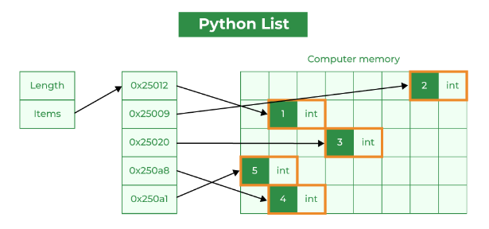
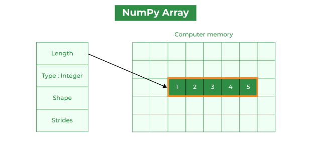
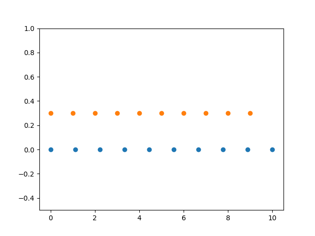
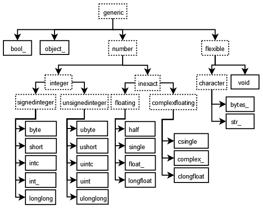

# Numpy Basics

## Python list vs Numpy array

1. **Memory Consumption between Python List and Numpy Array**
    A Python list stores elements as separate objects, each with its own type info, reference count, and other information, which can be of any type. However, a Numpy array is a densely packed array of homogeneous type, meaning all elements in the array are of the same type, significantly reducing memory usage.<br>
    For the range of number from 0 to 100000,
    ||
    |:--:|
    |*Python List storing Data*|

    ||
    |:--:|
    |*Numpy Array storing Data*|

    1. Python List uses **800056 bytes** of memory.
    2. Numpy Array use **800112 bytes** of memory.
    <br>

2. **Time Comparison between Python List and Numpy Array**
    Because Numpy uses contiguous blocks of memory, it can take advantage of vectorized operations, which are processed by your computer’s SIMD (Single Instruction, Multiple Data) capabilities. This results in faster computations. Python’s lists, on the other hand, do not benefit from this due to their scattered memory storage.<br>
    For adding the two list and array of the range of number of 100000,

    1. Python List takes **0.1633031s** of time.
    2. Numpy Array use **0.0031833s** of time.

    Numpy is **0.1601762s** faster than Python for same operation. Numpy is **58.312** times faster than Python lists.

## Numpy Functions 

1. **numpy.zeros and numpy.zeros_like**
    1. `np.zeros`: It creates the array filled with 0 's of given shape and data_type.
    2. `np.zeros_liek`: It creates an array of zeros with the same shape and type as a given array.

    ```python
    # Returns a new array of given shape and type, filled with zeros.
    print(np.zeros(10))

    x = np.arange(9).reshape((3, 3))

    # Returns a array of zeros with the same shape and type as a given array.
    np.zeros_like(x)
    ```

    ```output
    <<Output
    [0. 0. 0. 0. 0. 0. 0. 0. 0. 0.]

    array([[0, 0, 0],
        [0, 0, 0],
        [0, 0, 0]])
    ```

<br>

2. **numpy.ones and numpy.ones_like**
    1. `np.ones`: It creates the array filled with 0 's of given shape and data_type.
    2. `np.ones_like`: It creates an array of zeros with the same shape and type as a given array.

    ```python
    # Returns a new array of given shape and type, filled with ones.
    print(np.ones(10))

    x = np.arange(6).reshape((2, 3))

    # Returns a array of ones with the same shape and type as a given array.
    np.ones_like(x)
    np.zeros_like(x)
    ```

    ```output
    <<Output
    [1. 1. 1. 1. 1. 1. 1. 1. 1. 1.]

    array([[1, 1, 1],
           [1, 1, 1]])
    ```

<br>

3. **numpy.identity**
    It creates the identity array. The identity array is a square array with ones on the main diagonal.

    ```python
    # Return the identity array.
    print(np.identity(3))
    ```

    ```output
    <<Output
    [[1. 0. 0.]
    [0. 1. 0.]
    [0. 0. 1.]] 
    ```

<br>

4. **numpy.full**
   It creates a new array of given shape and type, filled with fill_value.

    ```python
    # Returns a new array of given shape and type, filled with fill_value.
    print(np.full((2, 2), [1,4]))

    print(np.full((2,2),np.inf))

    print(np.full((3,3), 10))
    ```

    ```output
    <<Output
    [[1 4]
    [1 4]]

    [[inf inf]
    [inf inf]]

    [[10 10 10]
    [10 10 10]
    [10 10 10]]
    ```

<br>

5. **numpy.arange**
   It creates a array of spaced values within a given interval [start, ]stop.
    - `arange(stop)`: Values are generated within the half-open interval [0, stop) (in other words, the interval including start but excluding stop).

    - `arange(start, stop)`: Values are generated within the half-open interval [start, stop).

    - `arange(start, stop, step)`: Values are generated within the half-open interval [start, stop), with spacing between values given by step.

    ```python
    # Returns a array of evenly spaced values within a given interval.
    print(np.arange(6))
    print(np.arange(3.0))

    # Returns a array of spaced values within a given interval [start, ]stop
    print(np.arange(3,10))
    ```

    ```output
    <<Output
    [0 1 2 3 4 5]

    [0. 1. 2.]

    [3 4 5 6 7 8 9]
    ```

<br>

6. **np.linspace**
   It creates a array of evenly spaced numbers over a specified interval.

    ```python
    # Returns a array of evenly spaced numbers over a specified interval. num = Number of samples to generate
    print(np.linspace(2.0, 3.0, num=5))

    # endpoint = If True, stop is the last sample. Otherwise, not included.
    print(np.linspace(2.0, 3.0, num=5, endpoint=False))

    # retstep = If True, return (samples, step = spacing between samples )
    print(np.linspace(2.0, 3.0, num=5, retstep=True))
    ```

    ```output
    <<Output
    [2.   2.25 2.5  2.75 3.  ]

    [2.  2.2 2.4 2.6 2.8]

    (array([2.  , 2.25, 2.5 , 2.75, 3.  ]), 0.25)
    ```

    1. Visualization in Matplotlib:

    ```python
    N = 10
    y = np.zeros(N)
    x1 = np.linspace(0, 10, N, endpoint=True)
    x2 = np.linspace(0, 10, N, endpoint=False)
    plt.plot(x1, y, 'o')
    plt.plot(x2, y + 0.3, 'o')
    plt.ylim([-0.5, 1])

    plt.show()
    ```

    ||
    |:--:|
    |*Visualization of linspace*|

<br>

7. **numpy.empty**
   Return a new array of given shape and type, without initializing entries.

    ```python
    # Returns a array with the same shape and type as a given array (function does not initialize the returned array).
    np.empty([2,3])
    ```

    ```output
    <<Output
    array([[0.53222222, 0.33722222, 0.53222222],
           [4.03322222, 5.49222222, 0.33722222]])
    ```

<br>

8. **numpy.matrix**
   It creates a matrix from an array-like object, or from a string of data. A matrix is a specialized 2-D array that retains its 2-D nature through operations.

    ```python
    # Returns a matrix from an array-like object, or from a string of data
    print(np.matrix('5 4; 3 2'))

    x = np.array([[1, 2], [3, 4]])
    m = np.matrix(x)
    print(m)
    x[0][0] = 5
    print(m)
    ```

    ```output
    <<Output
    [[5 4]
    [3 2]]

    [[1 2]
    [3 4]]

    [[1 2]
    [3 4]]
    ```

<br>

9. **numpy.mat**
    Unlike matrix iit does not make a copy if the input is already a matrix or an ndarray. Equivalent to matrix(data, copy=False).

    ```python
    # Unlike matrix does not make a copy if the input is already a matrix. Equivalent to matrix(data, copy=False).
    x = np.array([[1, 2], [3, 4]])
    m = np.mat(x)
    print(m)
    x[0][0]=8
    print(m)
    ```

    ```output
    <<Output
    [[1 2]
    [3 4]]

    [[8 2]
    [3 4]]
    ```

<br>

10. **numpy.bmat**
    It creates a matrix object from a string, nested sequence, or array.

    ```python
    # Build a matrix object from a string, nested sequence, or array.
    A = np.mat('1 2; 5 6')
    B = np.mat('3 4; 7 8')
    C = np.mat('9 10; 13 14')
    D = np.mat('11 12; 15 16')

    np.bmat([[A, B], [C, D]])
    ```

    ```output
    <<Output
    matrix([[ 1,  2,  3,  4],
            [ 5,  6,  7,  8],
            [ 9, 10, 11, 12],
            [13, 14, 15, 16]])
    ```

## Numpy Data Types

1. **Heirarchy of the Data Types in Numpy**
    ||
    |:--:|
    |*Heirarchy of the Data Types*|

<br>

2. **Table for Numpy Data Types**

    | NumPy Data Type | Description| Access Example|
    |-----------------|------------|---------------|
    | bool_           | Boolean (True/False)                               | `np.array([True, False])`      |
    | int_            | Default integer                                    | `np.array([1, 2, 3])`          |
    | intp            | Integer used for indexing (platform-dependent)    | `np.array([1, 2, 3], dtype=np.intp)` |
    | int8            | 8-bit integer                                      | `np.array([1, 2, 3], dtype=np.int8)` |
    | int16           | 16-bit integer                                     | `np.array([1, 2, 3], dtype=np.int16)` |
    | int32           | 32-bit integer                                     | `np.array([1, 2, 3], dtype=np.int32)` |
    | int64           | 64-bit integer                                     | `np.array([1, 2, 3], dtype=np.int64)` |
    | uint8           | Unsigned 8-bit integer                             | `np.array([1, 2, 3], dtype=np.uint8)` |
    | uint16          | Unsigned 16-bit integer                            | `np.array([1, 2, 3], dtype=np.uint16)` |
    | uint32          | Unsigned 32-bit integer                            | `np.array([1, 2, 3], dtype=np.uint32)` |
    | uint64          | Unsigned 64-bit integer                            | `np.array([1, 2, 3], dtype=np.uint64)` |
    | float_          | Default float (same as float64)                    | `np.array([1.0, 2.5, 3.3])`    |
    | float16         | 16-bit floating-point number                       | `np.array([1.0, 2.5, 3.3], dtype=np.float16)` |
    | float32         | 32-bit floating-point number                       | `np.array([1.0, 2.5, 3.3], dtype=np.float32)` |
    | float64         | 64-bit floating-point number (default for float)  | `np.array([1.0, 2.5, 3.3], dtype=np.float64)` |
    | complex_        | Default complex (same as complex128)               | `np.array([1 + 2j, 3 + 4j])`   |
    | complex64       | Complex number represented by two 32-bit floats    | `np.array([1 + 2j, 3 + 4j], dtype=np.complex64)` |
    | complex128      | Complex number represented by two 64-bit floats    | `np.array([1 + 2j, 3 + 4j], dtype=np.complex128)` |

<br>

3. **Some Functions used for Data Types**

   1. Some Data Type examples

        ```python
        # Float 
        x = np.float32(1.0)
        print(x)

        # Integer
        y = np.int_([1,2,4])
        print(y)

        # Unit8 (0-255)
        z = np.arange(3, dtype=np.uint8)
        print(z)
        ```

        ```output
        <<Output
        1.0

        [1 2 4]

        [0 1 2]
        ```

   2. Converting the Data Types

        ```python
        # Converting data type of z into float and int8
        print(z.astype(float))

        print(np.int8(z))
        ```

        ```output
        <<Output
        [0. 1. 2.]

        [0 1 2]
        ```

   3. Checking the Data Type of array

        ```python
        # Checking the data type of d
        d = np.dtype(int)
        print(np.issubdtype(d, np.integer))
        print(np.issubdtype(d, np.floating))
        ```

        ```output
        <<Output
        True
        False
        ``` 

   4. Overflow Error

        ```python
        # np.power evaluates 100 ** 8 correctly for 64-bit integers, but incorrect for a 32-bit integer.
        print(np.power(100, 8, dtype=np.int64))

        print(np.power(100, 8, dtype=np.int32))

        # Bounds of the data types 
        print(np.iinfo(np.int64))

        print(np.iinfo(np.int64))

        print(np.finfo(np.float64))
        ```

        ```output
        <<Output
        10000000000000000
        1874919424
        Machine parameters for int64
        ---------------------------------------------------------------
        min = -9223372036854775808
        max = 9223372036854775807
        ---------------------------------------------------------------

        Machine parameters for int64
        ---------------------------------------------------------------
        min = -9223372036854775808
        max = 9223372036854775807
        ---------------------------------------------------------------

        Machine parameters for float64
        ---------------------------------------------------------------
        precision =  15   resolution = 1.0000000000000001e-15
        machep =    -52   eps =        2.2204460492503131e-16
        negep =     -53   epsneg =     1.1102230246251565e-16
        minexp =  -1022   tiny =       2.2250738585072014e-308
        maxexp =   1024   max =        1.7976931348623157e+308
        nexp =       11   min =        -max
        smallest_normal = 2.2250738585072014e-308   smallest_subnormal = 4.9406564584124654e-324
        ---------------------------------------------------------------
        ``` 
