- [Color Spaces and Histogram](#color-spaces-and-histogram)
  - [Histogram of Image](#histogram-of-image)
    - [Algorithm of Creating Histogram in Opencv](#algorithm-of-creating-histogram-in-opencv)
  - [RGB Model](#rgb-model)
    - [Histogram and R,G and B color channel  of Image](#histogram-and-rg-and-b-color-channel--of-image)
  - [BGR Model](#bgr-model)
    - [Histogram and B,G and R color channel  of Image](#histogram-and-bg-and-r-color-channel--of-image)
  - [CMYK Model](#cmyk-model)
    - [Histogram and C, M, Y and K color channel  of Image](#histogram-and-c-m-y-and-k-color-channel--of-image)
  - [HSV Model](#hsv-model)
    - [Value Range of HSV](#value-range-of-hsv)
    - [Mathematical Equations to convert RGB to HSV](#mathematical-equations-to-convert-rgb-to-hsv)
    - [Histogram and H, S and V color channel  of Image](#histogram-and-h-s-and-v-color-channel--of-image)
  - [Lab(CIE Lab) Model](#labcie-lab-model)
    - [Histogram and L, a and b color channel  of Image](#histogram-and-l-a-and-b-color-channel--of-image)
- [References](#references)

# Color Spaces and Histogram

## Histogram of Image

A histogram is a very important tool in Image processing. It is a graphical representation of the distribution of data.Histogram gives a graphical representation of the distribution of pixel intensities in a image.

The x-axis indicates the range of values the variable can take. This range can be divided into a series of intervals called bins. The y-axis shows the count of how many values fall within that interval or bin.

When plotting the histogram we have the pixel intensity in the X-axis and the frequency in the Y-axis. As any other histogram we can decide how many bins to use.

The histogram of an image is gives an intuition regarding some properties of the image such as the tonal range, the contrast and the brightness.

We can convert bin for the image using range of the image values. For example, RGB color space have [0,256] as value range and we can segment our range in subparts (called bins) like:
```math
\begin{split}\begin{array}{l} [0, 255] = { [0, 15] \cup [16, 31] \cup ....\cup [240,255] } \\ range = { bin_{1} \cup bin_{2} \cup ....\cup bin_{n = 15} } \end{array}\end{split}
```
An histogram can keep count not only of color intensities, but of whatever image features that we want to measure (i.e. gradients, directions, etc).

Some parts of the histogram:

* dims : The number of parameters you want to collect data of. In our example, dims = 1 because we are only counting the intensity values of each pixel (in a greyscale image).
* bins : It is the number of subdivisions in each dim. In our example, bins = 16
* range : The limits for the values to be measured. In this case: range = [0,255]

### Algorithm of Creating Histogram in Opencv

* Loads an image.
* Splits the image into its three or more color space planes using the function `cv::split`.
* Calculate the Histogram of each 1-channel plane by calling the function `cv::calcHist`.
* Plot the three histograms in a window.
  
## RGB Model

RGB color model consist of three primary color i.e Red, Green, Blue.The RGB color model is an additive color model in which red, green, and blue are added together in various ways to reproduce a wide range of colors.

In RGB a pixel is represented using 8 bits for each red, green, and blue. This creates a total of around 16.7 million colors (2²⁴). Red is (255,0,0), Green (0,255,0) and Blue (0,0,255) in RGB format.

We can also create Cyan, Magenta, Yellow, White from the combination of these colors.

```python
Colour combination: 
Green(255) + Red(255) = Yellow 
Green(255) + Blue(255) = Cyan
Red(255) + Blue(255) = Magenta
Red(255) + Greeb(255) + Blue(255) = White
```

|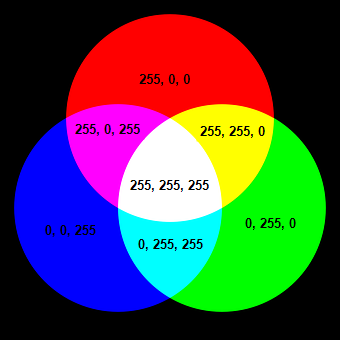|
|:--:|
|*RGB Color Space and their additive combination*|

We can also see the RGB colors in 3d plane in the form of the cube.RGB values will be at the corners present on the three axes. The origin will be black, and the diagonal opposite to the origin will be black. The rest three corners of the cube will be cyan, magenta, and yellow. Inside the cube, we get a variety of colors represented by the RGB vector.

|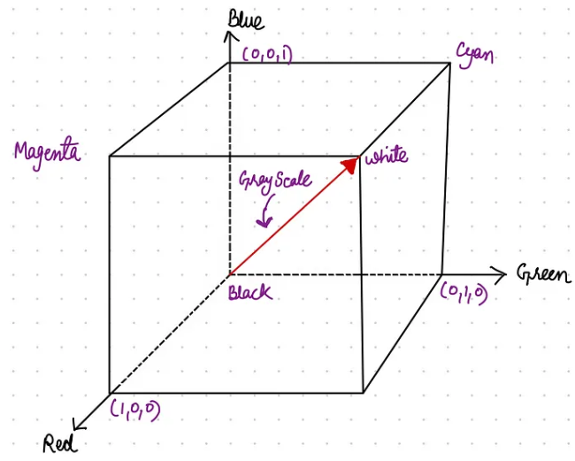|
|:--:|
|*RGB Color and CMYK color in 3d space*|

### Histogram and R,G and B color channel  of Image

1. Original Image:

   |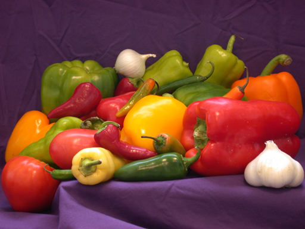|
   |:--:|
   | *Original Image* |

2. R, G and B channel of images:

   |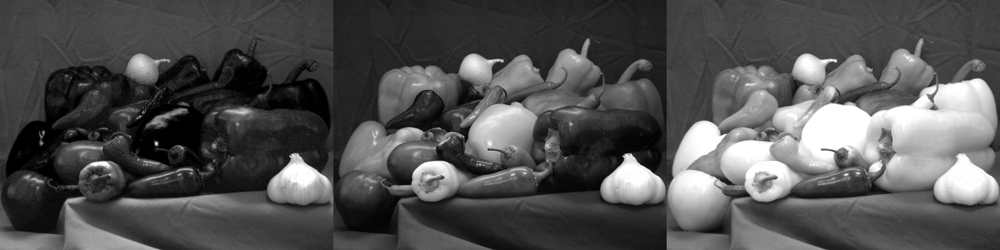|
   |:--:|
   | *Red, Blue and Green channels of the Image* |

3. Histogram:

   |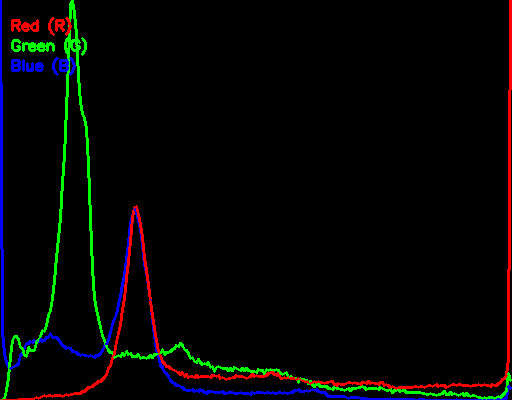|
   |:--:|
   | *Histogram of 3 Channels of RGB color space* |

## BGR Model

It is same as RGB color model but in reverse order i.e Blue, Green and Red. It is made popular by OpenCV since opencv reads the image in the BGR format.

### Histogram and B,G and R color channel  of Image

1. Original Image:

   ||
   |:--:|
   | *Original Image* |

2. R, G and B channel of images:

   ||
   |:--:|
   | *Red, Blue and Green channels of the Image* |

3. Histogram:

   ||
   |:--:|
   | *Histogram of 3 Channels of RGB color space* |

## CMYK Model

CMYK stands for Cyan, Magenta, Yellow, Key/Black. It is the color scheme used for projects including printed materials. This color mode uses the colors cyan, magenta, yellow and black as primary colors which are combined in different extents to get different colors. 

This color scheme is a subtractive type mode that combines the colors:- cyan, magenta, yellow and black in various degrees which creates a variety of different colors. 

||
|:--:|
|*CMYK color space and their combination*|

A printing machine creates images by combining these colors with physical ink. when all colors are mixed with 0% degree white color is created, exp CMYK(0%, 0%, 0%, 0%) for white, when all colors are mixed, we get the black color. 

The relationship between the RGB and CMY color models is given by:

```python
RGB = 1 — CMY or CMY = 1 — RGB
```

### Histogram and C, M, Y and K color channel  of Image

1. Original Image:

   ||
   |:--:|
   | *Original Image* |

2. C, M, Y and K channel of images:

   |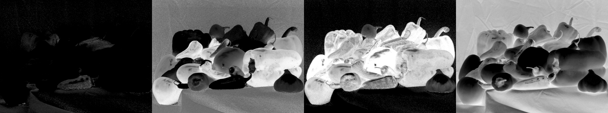|
   |:--:|
   | *Cyan, Magenta, Yellow, Key/Black of the Image* |

3. Histogram:

   |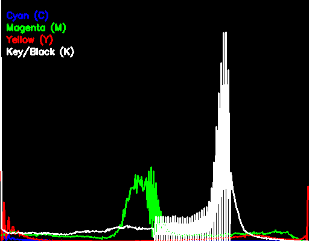|
   |:--:|
   | *Histogram of 4 Channels of CMYK color space* |

## HSV Model

HSI stands for Hue, Saturation, and Value. When humans view a color object, its hue, saturation, and brightness are described.

* **Hue:** It is a color attribute that describes a pure color.
* **Saturation:** It measures the extent to which a pure color is diluted by white light.
* **Value:** It depends upon color intensity, which is a key factor in describing the color sensation. The intensity is easily measurable, and the results are also easily interpretable.
  
**Note: RGB is great for color generation, but HSV is great for color description.**

### Value Range of HSV

* **Hue:** Its value ranges from 0° to 360° or can be normalized to 0–1. It can be described as an angle on the above circle, and each degree represents a distinct color.

* **Saturation:** Its value ranges from 0 to 1 or 0-255 ; 0 means no color, while 1 or 255 illustrates the full color. The lower the saturation value, the grayer is present in color, causing it to appear.

* **Value:** It has a range of 0–255 or normalized 0–1.

|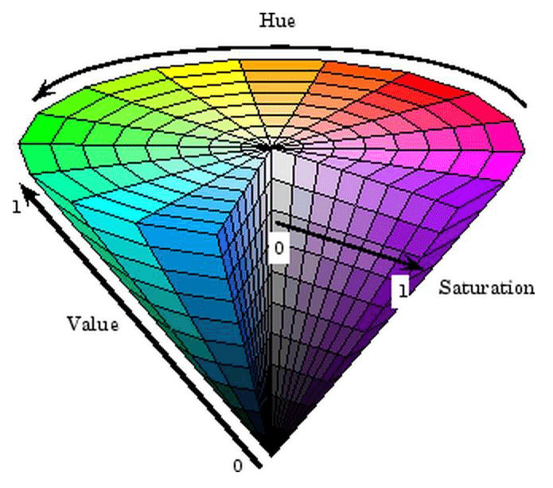|
|:--:|
|*HSV color space and Hue, Saturation and Value*|

### Mathematical Equations to convert RGB to HSV

The R,G,B values are divided by 255 to change the range from 0.....255 to 0.....1:
```math
\begin{split}\begin{array}{l} R' = R/255 \\ G' = G/255 \\ B' = B/255 \\ C_{\max} = max(R', G', B') \\ C_{\min} = min(R', G', B') \\ Δ = C_{\max} - C_{\min} \\ \end{array}\end{split}
```
```math
\ Hue \ Calculation: \\
```
```math
H=\left\{\begin{array}{ll}60^{\circ} \times\left(\frac{Q^{\prime \prime}-B^{\prime}}{\Delta} \bmod 6\right) & \ C_{\max} =R^{\prime} \\ 60^{\circ} \times\left(\frac{B^{\prime}-1}{\Delta}+2\right) & , C_{\max} =C^{\prime} \\ 00^{\circ} \times\left(\frac{R^{\prime}-C^{\prime \prime}}{\Delta}+4\right) & , C_{\max} =B^{\prime}\end{array}\right.
```
```math
Saturation \ Calculation:\\
```
```math
S=\left\{\begin{array}{cc}0 & , C_{\max }=0 \\ \frac{\Delta}{C_{\max }} & , C_{\max } \neq 0\end{array}\right.
```
```math
Value \ Calculation:
```
```math
V = C_{\max }
```

### Histogram and H, S and V color channel  of Image

1. Original Image:

   ||
   |:--:|
   | *Original Image* |

2. H, S and V channel of images:

   |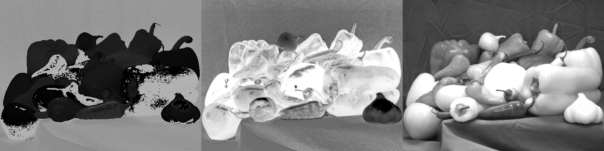|
   |:--:|
   | *Hue, Saturation and Value of the Image* |

3. Histogram:

   |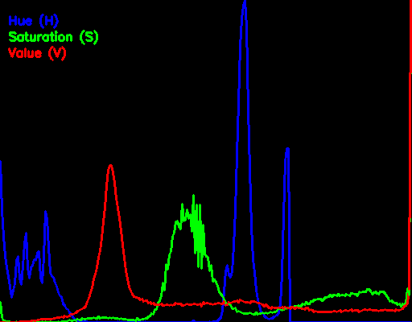|
   |:--:|
   | *Histogram of 3 Channels of HSV color space* |

## Lab(CIE Lab) Model

CIELAB color space is a device-independent, "standard observer" model. The colors it defines are not relative to any particular device such as a computer monitor or a printer, but instead relate to the CIE standard observer which is an averaging of the results of color matching experiments under laboratory conditions.

* "**L" represents brightness**:
The larger the value of L, the brighter. The smaller the darker. The range of this value is approximately 0-100. When the value is 0, it represents black and when the value is 100, it represents white. 

* **"a" stands for red and green**
The value from negative to positive is the evolution from green to red. 

* **"b" stands for blue and yellow**
The evolution from negative to positive is the evolution from blue to yellow.

Under normal circumstances, Lab represents real numbers. When the values of a and b are both 0, it represents gray. In the process of actual use, the range of color channel is -100~+100 or -128~127.

|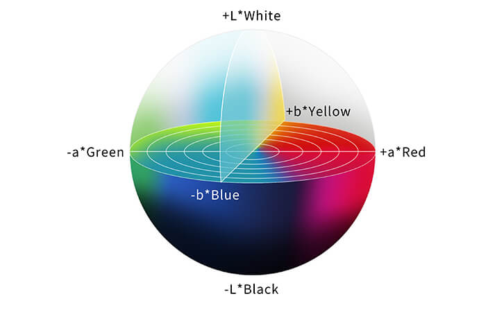|
|:--:|
|*Lab color space and Lightness, red and green, blue and yellow*|

### Histogram and L, a and b color channel  of Image

1. Original Image:

   ||
   |:--:|
   | *Original Image* |

2. L, a and b channel of images:

   |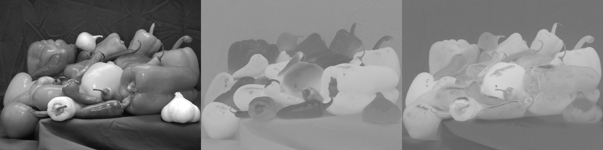|
   |:--:|
   | *Lightness, red and green and blue and yellow of the Image* |

3. Histogram:

   |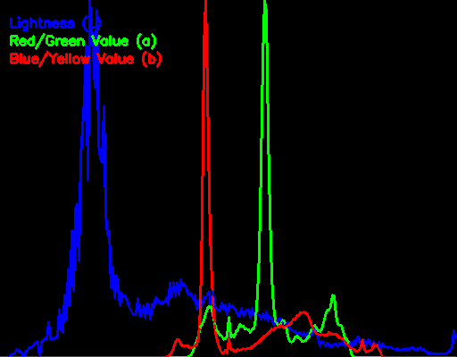|
   |:--:|
   | *Histogram of 3 Channels of Lab color space* |

# References

- [Histogram Calculation](https://vovkos.github.io/doxyrest-showcase/opencv/sphinx_rtd_theme/page_tutorial_histogram_calculation.html)
- [Various Color Models Used in Digital Image Processing](https://levelup.gitconnected.com/various-color-models-used-in-digital-image-processing-77d7289a2f2c)
- [OpenCV: From RGB to CMYK](https://gist.github.com/wyudong/9c392578c6247e7d1d28)
- [Understanding image histograms with OpenCV](https://medium.com/@lmcaraig/understanding-image-histograms-with-opencv-667572a25c1f)
- [CIE Lab color space](https://www.linshangtech.com/tech/color-space-tech1439.html#:~:text=I.%20What%20is,or%20%2D128~127.)
- [RGB to HSV Color Conversion Algorithm](https://math.stackexchange.com/questions/556341/rgb-to-hsv-color-conversion-algorithm)